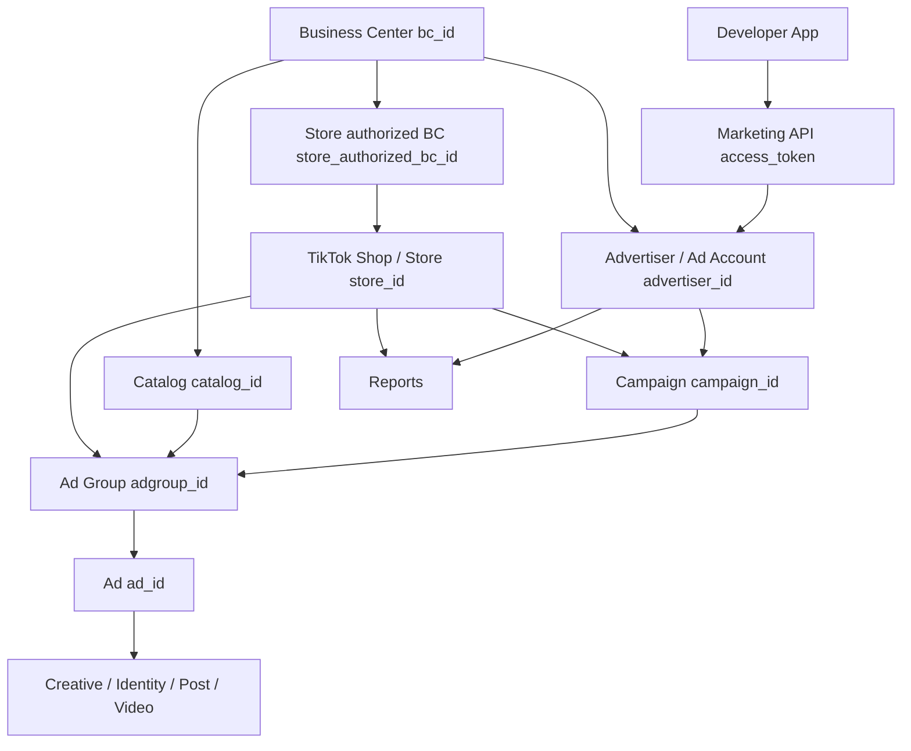

# TikTok Business / Ads API Notes

Research date: 2026-06-12

This folder summarizes official TikTok API for Business v1.3 docs for an EasyClaw first-pass `TikTokAdsClient` / Business API client. It intentionally records engineering-relevant fields, scopes, and open questions rather than copying full docs.

## Sources

- TikTok API for Business portal: https://business-api.tiktok.com/portal
- Account structure: https://business-api.tiktok.com/portal/docs?id=1740029179343874
- Authorization overview: https://business-api.tiktok.com/portal/docs?id=1781891256601602
- Marketing API authorization: https://business-api.tiktok.com/portal/docs?id=1738373141733378
- Authentication: https://business-api.tiktok.com/portal/docs?id=1738373164380162
- Permission scope appendix: https://business-api.tiktok.com/portal/docs?id=1753986142651394
- TikTok Store overview: https://business-api.tiktok.com/portal/docs?id=1763572749953025
- Campaign Management overview: https://business-api.tiktok.com/portal/docs?id=1735713781404673
- Ads structure: https://business-api.tiktok.com/portal/docs?id=1739381193120770
- Reporting overview: https://business-api.tiktok.com/portal/docs?id=1751087777884161
- Rate limits overview: https://business-api.tiktok.com/portal/docs/rate-limits/v1.3
- GMV Max API reference: https://business-api.tiktok.com/portal/docs?id=1822000911166465
- TikTok Shop Partner Center authorization pages checked as adjacent system:
  - https://partner.tiktokshop.com/docv2/page/authorization-overview-202407
  - https://partner.tiktokshop.com/docv2/page/get-authorized-shops
  - https://partner.tiktokshop.com/docv2/page/tts-api-concepts-overview

## File Index

- [AUTHORIZATION.md](/Users/gaoyangz/easyclaw/docs/API/TIKTOK_BUSINESS/AUTHORIZATION.md): advertiser authorization, token lifecycle, permission scopes, and shop/store auth boundary.
- [ADVERTISER.md](/Users/gaoyangz/easyclaw/docs/API/TIKTOK_BUSINESS/ADVERTISER.md): ad account endpoints and advertiser-scoped resources.
- [STORE_SHOP.md](/Users/gaoyangz/easyclaw/docs/API/TIKTOK_BUSINESS/STORE_SHOP.md): TikTok Store / Shop concepts, store endpoints, and bindings to Business Center/ad account.
- [CAMPAIGN.md](/Users/gaoyangz/easyclaw/docs/API/TIKTOK_BUSINESS/CAMPAIGN.md): campaign, ad group, ad, identity, and catalog/product inputs.
- [REPORTING.md](/Users/gaoyangz/easyclaw/docs/API/TIKTOK_BUSINESS/REPORTING.md): integrated report, creative report, GMV Max report, dimensions, and metrics.
- [GMV_MAX.md](/Users/gaoyangz/easyclaw/docs/API/TIKTOK_BUSINESS/GMV_MAX.md): Product/LIVE GMV Max endpoints and required IDs.
- [RATE_LIMITS.md](/Users/gaoyangz/easyclaw/docs/API/TIKTOK_BUSINESS/RATE_LIMITS.md): global developer-app limits, endpoint-specific limits, and Airflow limiter implications.
- [DATA_MODEL_NOTES.md](/Users/gaoyangz/easyclaw/docs/API/TIKTOK_BUSINESS/DATA_MODEL_NOTES.md): EasyClaw data model and agent tool recommendations.
- [APP_AGENT_ADS_STRATEGY.md](/Users/gaoyangz/easyclaw/docs/API/TIKTOK_BUSINESS/APP_AGENT_ADS_STRATEGY.md): EasyClaw product characteristics, agent tool surfaces, API groups needed for analysis/budget/launch.
- [BUDGET_BIDDING_STATUS.md](/Users/gaoyangz/easyclaw/docs/API/TIKTOK_BUSINESS/BUDGET_BIDDING_STATUS.md): budget/status mutations, bidding recommendations, finance read endpoints.
- [TARGETING_AUDIENCE.md](/Users/gaoyangz/easyclaw/docs/API/TIKTOK_BUSINESS/TARGETING_AUDIENCE.md): targeting helpers, audience management, Smart Targeting, content exclusions.
- [CREATIVE_ASSETS_REVIEW.md](/Users/gaoyangz/easyclaw/docs/API/TIKTOK_BUSINESS/CREATIVE_ASSETS_REVIEW.md): asset upload/search, preview, review, fatigue, diagnosis, labels.
- [MEASUREMENT_EVENTS.md](/Users/gaoyangz/easyclaw/docs/API/TIKTOK_BUSINESS/MEASUREMENT_EVENTS.md): Events API, pixels, custom conversions, CTM event sets, leads.
- [CATALOG_WRITE_DIAGNOSTICS.md](/Users/gaoyangz/easyclaw/docs/API/TIKTOK_BUSINESS/CATALOG_WRITE_DIAGNOSTICS.md): catalog/product writes, product sets, event-source binding, catalog diagnostics.
- [AUTOMATION_WEBHOOKS_EXPERIMENTS.md](/Users/gaoyangz/easyclaw/docs/API/TIKTOK_BUSINESS/AUTOMATION_WEBHOOKS_EXPERIMENTS.md): automated rules, subscriptions/webhooks, split tests, terms status.
- [CAMPAIGN_CREATE_MATRIX.md](/Users/gaoyangz/easyclaw/docs/API/TIKTOK_BUSINESS/CAMPAIGN_CREATE_MATRIX.md): launch workflow matrix for Web, Lead, Shopping/Catalog, GMV Max, Search, and Smart+ create flows.
- [PERMISSION_ENDPOINT_MATRIX.md](/Users/gaoyangz/easyclaw/docs/API/TIKTOK_BUSINESS/PERMISSION_ENDPOINT_MATRIX.md): permission scope to endpoint mapping for app review and tool gating.
- [MUTATION_SAFETY_MATRIX.md](/Users/gaoyangz/easyclaw/docs/API/TIKTOK_BUSINESS/MUTATION_SAFETY_MATRIX.md): read/write risk classes, approval requirements, and mutation audit rules.
- [REPORT_PRESETS.md](/Users/gaoyangz/easyclaw/docs/API/TIKTOK_BUSINESS/REPORT_PRESETS.md): server-side report templates for AI agents and metric normalization.
- [VALIDATION_CHECKLIST.md](/Users/gaoyangz/easyclaw/docs/API/TIKTOK_BUSINESS/VALIDATION_CHECKLIST.md): real-account validation and error-code checklist.

## Core Conclusions

TikTok Business API is primarily advertiser/ad-account scoped. The Marketing API authorization flow grants an access token from an advertiser, and the token response can include the advertiser IDs and permission scope. Most campaign, ad group, ad, creative, and integrated reporting endpoints require `advertiser_id`.

TikTok Store / Shop appears inside Business API as a resource reachable through an ad account and/or Business Center, not as a standalone Ads API token root. Store endpoints use `advertiser_id`, `bc_id`, `store_id`, and `store_authorized_bc_id` depending on the operation. TikTok Shop Open API, documented in Partner Center, is a separate API family and authorization path; it should not be collapsed into Marketing API authorization without product-level separation.

GMV Max is explicitly tied to TikTok Shop. GMV Max endpoints generally require `advertiser_id`; shop selection and reports require `store_id` or `store_ids`, and several creative/product helpers also require `store_authorized_bc_id`. Product GMV Max can use product SPU IDs (`item_group_ids`), while catalog-based Shopping Ads use `catalog_id`, `catalog_authorized_bc_id`, product sets, products, and SKU IDs.

No official page reviewed states that campaign/reporting data can be read from a shop/store perspective after the ad account is blocked, suspended, or otherwise unavailable. The GMV Max store endpoints expose `advertiser_status` in exclusive authorization metadata, including suspended/disabled states, but reporting APIs still require `advertiser_id`.

For EasyClaw's AI agent roadmap, TikTok Ads integration should be split into four capability tiers:

1. Read-only analysis: account context, campaign inventory, reports, diagnostics, catalog readiness, event-source health.
2. Recommendations: budget plans, bid/budget suggestions, targeting drafts, creative/campaign improvement plans.
3. Controlled mutations: budget/status changes, automated rules, split test actions, all requiring approval and server-side limits.
4. Launch mutations: campaign/adgroup/ad/GMV Max creation, asset upload, catalog writes, event-source setup, all staged as drafts before enablement.

## Concept Relationship

## Backend Modeling Recommendations

Start with separate entities for advertiser, shop/store binding, campaigns, creatives, and report facts:

- `AdsAdvertiser`: TikTok ad account identity, status, currency, timezone, token linkage.
- `AdsStore` and/or `AdsShopBinding`: `store_id`, `store_authorized_bc_id`, `bc_id`, store role/status, exclusive advertiser metadata.
- `AdsCampaign`, `AdsAdGroup`, `AdsAd`: advertiser-scoped hierarchy; include GMV Max subtype fields and product source fields.
- `AdsCreative`: identity, video/post, catalog product, custom post, and ad creative identifiers.
- `AdsReportFact`: normalized report facts by platform, scope, report type, data level, dimensions hash, metric names, and stat date/hour.

Keep advertiser OAuth and Shop Open API OAuth as separate product experiences. Business API store access is not enough evidence that a seller/shop token can replace advertiser authorization for ads management or reporting.

## API Coverage Matrix

Current estimate for EasyClaw's Ads-agent roadmap: approximately 80-85% covered at the API planning/documentation level. For the full TikTok Business API surface, including RF, TCM, Creator, Ad Comments, TikTok Accounts, BC admin, invoice, Pangle, playable ads, instant pages, and other non-core families, this folder is still closer to 55-60%.

| Area | Covered files | Status |
|---|---|---|
| Authorization and account structure | `AUTHORIZATION.md`, `ADVERTISER.md`, `STORE_SHOP.md` | Covered for first client. |
| Campaign/adgroup/ad read and create/update surface | `CAMPAIGN.md`, `CAMPAIGN_CREATE_MATRIX.md`, `GMV_MAX.md` | Covered for first launch planning; exact enum combinations still need implementation validation. |
| Reports for campaign/cost/net cost/budget/ROI/gross revenue/SKU orders/creative | `REPORTING.md`, `REPORT_PRESETS.md`, `GMV_MAX.md` | Covered with metric mapping, presets, and scope notes. |
| Budget, status, bidding recommendations, finance reads | `BUDGET_BIDDING_STATUS.md` | Newly covered for agent budget management. |
| Targeting and audiences | `TARGETING_AUDIENCE.md` | Newly covered at endpoint group level; exact audience subtype schemas need verification. |
| Creative upload, preview, review, diagnosis | `CREATIVE_ASSETS_REVIEW.md` | Newly covered. |
| Measurement/events/leads | `MEASUREMENT_EVENTS.md` | Newly covered; raw lead/event data should be restricted. |
| Catalog writes and diagnostics | `CATALOG_WRITE_DIAGNOSTICS.md` | Newly covered. |
| Automation/webhooks/experiments/terms | `AUTOMATION_WEBHOOKS_EXPERIMENTS.md` | Newly covered. |
| Permission-to-endpoint planning | `PERMISSION_ENDPOINT_MATRIX.md` | Covered for P0/P1/P2 app review planning. |
| Mutation safety and agent guardrails | `MUTATION_SAFETY_MATRIX.md`, `APP_AGENT_ADS_STRATEGY.md` | Covered for first approval/audit design. |
| Real-account validation | `VALIDATION_CHECKLIST.md` | Checklist covered; empirical results still missing. |
| TikTok Shop Open API non-ads operations | Not in this folder except auth boundary notes | Not covered; separate research needed for orders/products/logistics/seller finance. |

## Permission Scope Coverage

Official source: TikTok API for Business Permission scope appendix, https://business-api.tiktok.com/portal/docs?id=1753986142651394.

The table below tracks TikTok Business permission scopes at first-level scope granularity. "Covered" means this folder has enough endpoint/source notes for a first client implementation. "Partial" means the important Ads-agent subset is documented, but the full permission family contains endpoints we have not summarized. "Missing" means this folder intentionally does not yet document that scope.

| Scope ID | Official first-level scope | Coverage | Current notes |
|---:|---|---|---|
| `1` | Ad Account Management | Partial | Covered: advertiser info, authorized advertisers, terms status, balance/budget reads, selected BC finance reads. Missing: full Business Center asset/member/partner/billing/invoice management, Pangle block lists/audience packages, ad account create/disable/update admin flows. |
| `2` | Ads Management | Covered for agent roadmap | Covered: campaign/adgroup/ad read, create/update surface, status update, adgroup budget update, split test, GMV Max campaign endpoints, Search Ads health. Missing/partial: full changelog API, Search Ads negative keyword management, every objective-specific create schema. |
| `3` | Audience Management | Partial | Covered: audience concepts, custom/customer-file/rule/lookalike/saved audience flows, targeting helper context. Missing: full field-by-field endpoint schemas, audience sharing/cancel/share logs, all segment mapping details. |
| `4` | Reporting | Covered for first client | Covered: integrated sync/async reporting, creative reports, GMV Max report, ad benchmark/video performance references, creative fatigue insight. Missing/partial: report subscription endpoints and full audience-report compatibility matrix. |
| `5` | Measurement | Partial | Covered: Events API 2.0 `/event/track/`, supported events/parameters at summary level. Missing: older `/app/track/`, `/app/batch/`, `/pixel/track/`, `/pixel/batch/` implementation details and full auth/token operational model. |
| `6` | Creative Management | Partial | Covered: image/video upload/search/info, thumbnails, ad preview, CTA recommendation, creative report, fatigue, asset share/delete, review/diagnosis. Missing: video templates, music upload/library, playable ads, instant pages, smart text, smart video, dynamic scene, smart fix, file-name check, full TikTok post authorization flows. |
| `7` | App Management | Partial | Covered only where needed for ads launch validation: app conversion/optimization event references. Missing: app list/info/create/update and app retargeting details. |
| `8` | Pixel Management | Partial | Covered: pixel list/create, pixel event create, custom conversion list/create. Missing: pixel update/delete, pixel event update/delete, instant page events, pixel event stats. |
| `9` | DPA Catalog Management | Covered for ads/product workflows | Covered: catalog get/create/update/delete, product upload/update/delete/get, product sets, catalog videos, event-source binding, catalog diagnostics. Missing/partial: catalog feed APIs, catalog templates, capitalization/migration/admin edge cases. |
| `10000` | Reach & Frequency | Missing | Not documented. Needed only if EasyClaw supports RF reservation/inventory/order workflows. |
| `12000000` | Lead Management | Partial | Covered: lead download task, lead download, form libraries, lead fields, lead get. Missing: test lead APIs and detailed PII/retention policy by market. |
| `13000000` | TikTok Creator Marketplace (TCM) | Missing | Not documented. Relevant for creator discovery/orders and Spark Ads creator invitations, but outside current Ads budget/campaign agent first pass. |
| `14000000` | TikTok Creator | Missing | Not documented. Creator user/media/order APIs are outside current Ads Business client. |
| `15000000` | Ad Comments | Missing | Not documented. Needed if agent will moderate ad comments, blocked words, or comment tasks. |
| `16000000` | TikTok business plugin | Missing | Not documented. No current EasyClaw Ads-agent requirement identified. |
| `17000000` | Automated Rules | Covered | Covered: rule create/get/list/results/update/status/bind. Mutating actions should require approval. |
| `18000000` | TikTok Accounts | Missing | Not documented except identity/post concepts under ads. Needed if managing business account media/comments/publishing directly. |
| `19000000` | Onsite Commerce Store | Partial for Business Ads | Covered: `/store/list/`, Business API store/product and GMV Max store binding concepts. Missing: `/commerce/store/create/`, `/commerce/store/bind_to_catalog/`, `/commerce/window/update/`, trusted create, and non-ads store admin flows. This is not TikTok Shop Open API. |
| `7043626160646946818` | Offline Events Management | Partial | Covered: offline event set create/get as launch validation. Missing: offline update/delete, one-by-one reporting, bulk reporting, full read/reporting workflow. |
| `7050363942434013185` | Ad Diagnosis | Covered | Covered: `/tool/diagnosis/get/`, Search Ads health diagnosis, review info, creative fatigue, catalog diagnostics. |
| `7294180478502830081` | CRM Event Management | Partial | Covered indirectly through Events API 2.0 and custom conversion notes. Missing: CRM event set list/create/update/delete details and full CRM event reporting workflow. |

## Resource Scope Coverage

This is separate from TikTok permission scope. It describes which object must be present for endpoint calls.

| Resource scope | Covered? | Examples |
|---|---|---|
| Advertiser-scoped | Yes | `advertiser_id` for campaign/adgroup/ad, reports, creatives, targeting tools, diagnosis, budget/status changes. |
| Business Center-scoped | Partial | `bc_id` for catalog, balance/cost, payment portfolios. Missing full BC admin/member/asset/invoice coverage. |
| BC/catalog-scoped | Yes for ads workflows | `bc_id` + `catalog_id` for catalog/products/product sets/videos/event-source diagnostics. |
| Store/shop binding-scoped inside Business API | Yes for ads workflows | `advertiser_id` + `store_id`/`store_authorized_bc_id` for `/store/list/`, store products, GMV Max, Shop Ads/Product Ads bindings. |
| Mixed advertiser + store | Yes | GMV Max campaign/report and Shop Ads/Product Ads flows requiring `advertiser_id` plus `store_id`/`store_ids`. |
| Shop Open API seller-scoped | No, intentionally separate | Orders/products/logistics/seller auth live in `/Users/gaoyangz/easyclaw/docs/API/TIKTOK_SHOP`, not this folder. |
| TikTok account/business user scoped | Missing | Business media/comment/publish APIs under TikTok Accounts are not documented here. |

## Still Uncertain

- Whether a disabled/suspended ad account can still read any historical GMV Max reporting via a store-only route. No reviewed Business API page says yes.
- Exact Partner Center Shop Open API authorization response shape and shop cipher fields need manual confirmation in the logged-in Partner Center docs.
- Some permission names for GMV Max endpoints appear to be expressed through app scope hierarchy rather than repeated on every endpoint page; app review should verify requested scopes against the portal UI.
