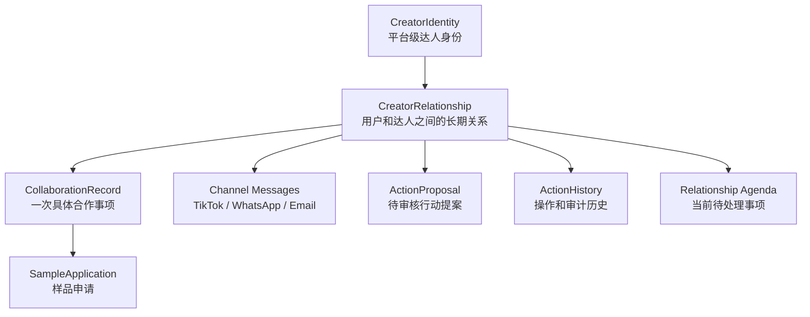

# Affiliate 产品设计：以 CreatorRelationship 为核心

## 背景

Affiliate 业务最初以 `CollaborationRecord` 作为核心工作对象：平台同步到新的样品申请、达人消息或履约进度后，系统围绕某一条合作记录判断状态、生成 work item，再由 Desktop 触发 Agent 处理。

这个设计在单店铺、单商品、单平台会话的场景下可工作，但在真实 BD 工作流里会遇到明显边界：

- 卖家和达人之间的联络关系通常是跨店铺的。BD 加到达人 WhatsApp 或 email 后，可能同时推进多个店铺、多个商品、多个合作。
- 同一个达人可能同时存在多个 ongoing collaboration。单条消息不一定天然属于某一个 collaboration。
- TikTok Shop 平台 chat、WhatsApp、email 是同一段达人关系的不同沟通渠道，不应该形成相互割裂的业务记忆。
- 如果继续让 `CollaborationRecord` 承担一级调度职责，系统会被迫把自然语言沟通硬路由到某个合作记录上，容易造成状态聚合、提案失效和 Agent context 不完整。

因此新的产品设计将 Affiliate 业务核心从“某一次合作记录”上移到“卖家和达人之间的长期关系”。

## 核心原则

### Implementation Focus Guard

这次重构的第一目标不是“代码里不能出现 conversationId”，而是让 Affiliate 业务的工作空间、状态、提案和 Agent 记忆都以 `CreatorRelationship` 为中心。

实现优先级按下面顺序判断：

1. `CreatorRelationship` 是否能表达“这个达人关系现在要推进什么、由谁推进、为什么”。
2. 同一个 `CreatorRelationship` 下是否最多只有一个 pending action proposal；新消息、新样品申请、新平台状态或人工处理是否会让旧 proposal 失效。
3. Agent dispatch 是否围绕 relationship agenda，而不是围绕某条 collaboration、某个 shop chat 或某次 sample application。
4. UI 是否让卖家看懂：我们和这个达人当前关系是什么、下一步该做什么、相关合作/样品/消息/历史动作在哪里。
5. Provider route / conversation / thread 是否被隐藏在同步、发送、重试、审计所需的技术层。

因此，`conversationId` 出现在 provider adapter、route/cursor、message fact evidence、delivery record、debug log 里是允许的。
它只有在成为 Agent tool input、Agent session key、proposal owner、work item owner、UI business detail route 或 relationship 状态来源时，才是设计错误。

换句话说：不要为了删除 `conversationId` 牺牲业务建模；要为了保护 `CreatorRelationship` 的一级语义，把 provider route 限制在技术边界内。

### Conversation Boundary Contract

这一版设计里，`conversation` / `thread` 不是产品语义，也不是 Agent 语义。
它最多是 provider transport state：平台、WhatsApp、email 为了同步、发送、回调、重试和幂等所需要的技术路由。

实现时按下面规则验收：

| Question | Correct Owner | Not Owner |
| --- | --- | --- |
| Agent 当前处理哪个业务空间？ | `CreatorRelationship` | provider conversation / shop thread / collaboration |
| Desktop/OpenClaw session key 用什么？ | `affiliate:{userId}:{creatorRelationshipId}` | `conversationId`, `shopId + conversationId`, `collaborationRecordId` |
| Action proposal 属于谁？ | `CreatorRelationship` | conversation / thread / single collaboration |
| Action history 属于谁？ | `CreatorRelationship` | conversation / thread |
| 跨渠道聊天历史怎么查？ | `creatorRelationshipId` + optional business filters | raw provider route id |
| 平台发送消息需要 route id 怎么办？ | delivery router 内部解析 | 让 Agent 传入 route id |
| technical conversation 是否落库？ | 默认不落库；必要时仅 internal cursor/route | business object / Agent workspace |

#### Conversation Persistence Decision Rule

`conversation` / `thread` 只在 provider 通信、同步 cursor、发送 retry、webhook reconciliation 或任务编排离不开它时才允许作为技术记录落库。
默认情况下，TikTok Shop `conversationId`、WhatsApp chat id、email thread id 只是一次 signal 的 route evidence，不会自动升级成 MongoDB 业务对象。

即使必须落库，technical conversation/cursor 也必须满足：

- owner 是 `creatorRelationshipId`，不是反过来让 relationship 依附 conversation。
- 只能被 provider adapter、sync worker、delivery router、retry/idempotency worker、audit/debug worker 使用。
- 不能带 `processingStatus`、`requiredAction`、`pendingProposalId`、`agentSessionId`、`workItemId` 这类业务字段。
- 不能作为 GraphQL business detail route、Desktop session key、Agent prompt subject、ActionProposal owner 或 Agent-facing tool input。

Agent-facing API 的规则更简单：工具输入只接受 `creatorRelationshipId` 和业务过滤条件。
例如 `get_creator_chat_history` 不能传 `conversation_id`，但返回的消息可以带 `channel=PLATFORM_CHAT`、`shopId=shopObjectId1`、`shopName=6号` 这类 provenance labels，帮助 Agent 理解“这条消息来自哪里”。

### Decision Boundary Contract

`AffiliateOperationalStateReconciler`、平台同步器和 prediction 工具都不能直接决定业务动作。

它们的职责边界是：

- 平台同步器负责把 operational facts 同步进 MongoDB，例如 conversation cursor、新消息到达状态、样品申请、样品物流和内容履约；消息正文由 provider on-the-fly 提供，并由 history pipeline 归档到 MySQL。
- `AffiliateOperationalStateReconciler` 负责把 MongoDB 事实对齐成 relationship agenda，例如“这个 CreatorRelationship 现在有一个待判断的样品申请”。
- prediction / threshold / policy / product / creator profile 都只是 Agent 的输入证据。
- Desktop Agent 负责基于完整 relationship context 判断是否要 `REVIEW_SAMPLE_APPLICATION`、`SEND_MESSAGE` 或 `CREATE_TARGET_COLLABORATION`。
- approval policy 只在 Agent 产出 typed action 之后生效，决定 action 是直接执行还是形成 relationship-level proposal。

因此不能出现这些 shortcut：

- 因为 expected sales 低于阈值，backend/reconciler 直接拒绝样品。
- 因为 expected sales 高于阈值，backend/reconciler 直接同意样品。
- 因为某类 sample application policy 配置为自动执行，就绕过 Desktop Agent 直接执行样品审核。
- 因为一个 work item “只有样品申请”，就认为它不需要 Agent 判断。

预测工具是 Agent tool，不是状态机规则；approval policy 是执行门槛，不是 Agent 判断替代品。

#### Agent Tool Contract

Agent-facing tool 的输入只允许表达业务意图，不能表达 provider 路由。

也就是说，Agent 只能说：

```text
我要处理这个 CreatorRelationship。
我要看这个 CreatorRelationship 下某个渠道、某个店铺语境、某段时间的聊天历史。
我要给这个 CreatorRelationship 发消息，倾向使用某个渠道或店铺语境。
```

Agent 不能说：

```text
我要打开某个 TikTok conversation。
我要回复某个 WhatsApp chat。
我要继续某个 email thread。
```

允许的 tool 输入：

```ts
get_creator_chat_history({
  creatorRelationshipId: "relationshipObjectId1",
  channelFilter: "PLATFORM_CHAT",
  shopId: "shopObjectId1",
  limit: 50
})

send_creator_message({
  creatorRelationshipId: "relationshipObjectId1",
  channelPreference: "WHATSAPP",
  shopId: "shopObjectId1",
  message: "Thanks, we will check the sample status."
})
```

禁止的 tool 输入：

```ts
get_creator_chat_history({ conversationId: "7584704889574392119" })
send_creator_message({ platformConversationId: "7584704889574392119", message: "..." })
send_creator_message({ whatsappChatId: "wa_...", message: "..." })
send_creator_message({ emailThreadId: "em_...", message: "..." })
```

这条规则适用于所有 Agent-facing tool：

- `get_creator_chat_history`
- `get_affiliate_workspace`
- `send_creator_message`
- `resolve_affiliate_work`
- `decide_action_proposal`
- `create_or_update_collaboration`
- 任何未来的 affiliate tool

如果 tool schema 需要定位业务上下文，primary key 是 `creatorRelationshipId`。
如果 tool schema 需要缩小范围，只能使用业务可读 filter，例如 `channelFilter`、`shopId`、`collaborationRecordId`、`sampleApplicationId`、时间范围、状态范围。
如果 tool schema 出现 `conversationId`、`platformConversationId`、`whatsappChatId`、`emailThreadId`、`providerThreadId` 作为输入参数，默认视为设计错误。

`affiliate_get_workspace` 也必须遵守同一规则：Agent 读取当前 Affiliate 工作空间时应传入 `creatorRelationshipId` 作为业务边界，`shopId` 只作为 entitlement 和店铺语境过滤。
返回结果可以包含这个 relationship 下的 collaborations、sample applications、pending proposals、creator profile、policies 和 campaign/product facts；不能把 provider conversation route 作为 workspace owner。

#### Tool Output Contract

Agent-facing tool 输出可以携带 provenance labels，但默认不能携带 raw provider route id。

这里的关键区别是：

```text
label = 给 Agent 理解上下文的业务可读来源
route = provider API / webhook / sync / delivery 内部寻址用的技术键
```

`get_creator_chat_history` 这类工具返回的是 relationship timeline，不是 provider conversation dump。
因此返回结果里可以告诉 Agent “这条消息来自 6 号店的 TikTok Shop chat”，但不应该告诉 Agent “这条消息属于 platformConversationId=xxx，并让 Agent 下次继续使用这个 id”。

允许的输出：

```ts
{
  messageId: "messageObjectId1",
  creatorRelationshipId: "relationshipObjectId1",
  channel: "PLATFORM_CHAT",
  channelLabel: "TikTok Shop chat",
  shopId: "shopObjectId1",
  shopName: "6号",
  accountLabel: "TikTok Shop / 6号",
  direction: "CREATOR_TO_SELLER",
  text: "Can you send the sample?",
  relatedCollaborationRecordIds: ["collaborationObjectId1"],
  relatedSampleApplicationIds: ["sampleApplicationObjectId1"]
}
```

这些 label 的含义是“这条消息来自哪个渠道和店铺语境”。
它们帮助 Agent 理解业务上下文，例如“这条消息来自 6 号店的 TikTok Shop chat”。
它们不表示“Agent 当前在哪个 conversation”，也不能被 Agent 当作下一次工具调用的 route。

默认禁止输出：

```ts
{
  conversationId: "7584704889574392119",
  platformConversationId: "7584704889574392119",
  whatsappChatId: "wa_...",
  emailThreadId: "em_..."
}
```

如果 audit/debug 真的需要展示 raw provider route id，必须放在显式隔离的 `debugEvidence` / `rawEvidence` 字段里，并且不能进入默认 Agent prompt、普通 UI 或 tool required output。
Agent 不应该通过读取 raw route id 来决定业务下一步。

同一条消息在不同层的形状应该不同：

```ts
// Agent-visible message fact
{
  messageId: "messageObjectId1",
  creatorRelationshipId: "relationshipObjectId1",
  channel: "PLATFORM_CHAT",
  shopId: "shopObjectId1",
  shopName: "6号",
  accountLabel: "TikTok Shop / 6号",
  direction: "CREATOR_TO_SELLER",
  text: "Can you send the sample?"
}

// Internal route evidence, only for provider adapter / delivery router / audit debugging
{
  messageId: "messageObjectId1",
  provider: "TIKTOK_SHOP",
  providerConversationId: "7584704889574392119",
  providerMessageId: "..."
}
```

Agent-facing API 只能返回第一种。第二种只能被 backend 内部模块或受限 debug/audit 工具读取。

#### Technical Conversation Persistence Rule

技术 conversation 非必要不落库。

默认持久化的是业务事实，不是 provider transport session。默认落库对象包括：

- `CreatorIdentity`
- `CreatorRelationship`
- relationship-level message facts
- relationship contacts
- `CollaborationRecord`
- nested `SampleApplication`
- `ActionProposal`
- `ActionHistory`

不因为 provider payload 里出现了 `conversationId` / `threadId` 就自动创建 conversation 记录。
落库前必须先问：

```text
如果不保存这条 technical conversation/cursor，
provider 同步、发送、回调对齐、重试、幂等或任务编排是否会不可恢复地失败？
```

如果答案是否，不能落库。
如果答案是，才允许保存 internal technical route/cursor。即使落库，也必须满足：

- 命名必须表达技术属性，例如 `AffiliateChannelCursor`、`AffiliateDeliveryRoute`、`AffiliateChannelConversationCursor`。
- 只能服务同步、发送、回调对齐、幂等、重试或任务编排。
- 不能作为 GraphQL business detail route。
- 不能作为 work item subject。
- 不能作为 proposal owner。
- 不能作为 Desktop/OpenClaw session key。
- 不能出现在 Agent-facing tool 的输入参数里。
- 默认不进入 prompt；debug/audit evidence 需要显式隔离。

这意味着有两种合法实现：

```text
Preferred:
  persist message facts under CreatorRelationship
  keep provider route only in transient sync/delivery context

Allowed only when required:
  persist internal channel cursor / delivery route
  bind it to CreatorRelationship
  hide it from Agent, proposal owner, UI business surface, and session key
```

不允许的实现：

```text
persist provider conversation
  -> expose conversationId to Agent
  -> use conversationId as session key
  -> attach proposal/work item/action history to conversation
```

#### Delivery And Scheduling Boundary

底层发送消息如果需要 raw provider route，解析必须发生在 backend 内部：

```text
Agent call:
  send_creator_message({ creatorRelationshipId, channelPreference, shopId, message })

Backend:
  creatorRelationshipId
    -> relationship contacts
    -> channel preference and shop context
    -> internal delivery route / provider cursor
    -> provider API receives platformConversationId / whatsappChatId / emailThreadId
```

任务调度同理。scheduler / sync worker 可以内部使用 provider route、cursor、dedupe key 来找到增量或做 retry，但 materialized work item、action proposal、action history、Desktop session 都必须回到 `CreatorRelationship`。

换句话说：

```text
technical conversation 可以帮助系统把消息送到正确 provider route。
technical conversation 不能帮助 Agent 理解当前业务是什么。
Agent 的理解边界只有 CreatorRelationship。
```

### 一级对象：CreatorRelationship

`CreatorRelationship` 表示一个用户和一个达人之间的长期业务关系。

它是 Agent 调度、当前待办、行动提案、跨渠道沟通上下文和人工审计的核心入口。

关键语义：

- 粒度：user-level。
- 一个用户和一个平台达人 identity 之间最多一条 active relationship。
- 可以覆盖多个 shop。
- 可以覆盖多个沟通渠道：TikTok Shop platform chat、WhatsApp、email。
- 可以同时包含多个 active 或 historical collaboration。
- 是 Agent 处理 Affiliate 业务时的默认 workspace boundary。

### 沟通模型：一段关系，一条业务时间线，多个技术通道

Affiliate 里“沟通”要分成三层，不能混在一起：

```text
Business workspace:
  CreatorRelationship

Business facts under the workspace:
  messages, collaborations, sample applications, proposals, action history

Technical transport state:
  TikTok platform conversation id, WhatsApp chat id, email thread id,
  sync cursor, delivery route, webhook reconciliation key
```

业务上，卖家和达人之间只有一条连续的 relationship timeline。
达人上午在 WhatsApp 回复、下午在 TikTok Shop 6 号店后台发消息、晚上发 email，这些都属于同一个 `CreatorRelationship` 的上下文。

技术上，provider 可能有多个 conversation/thread/chat。它们只回答“消息从哪里来、下次怎么发、webhook 怎么对齐”，不回答“Agent 当前应该处理哪个业务对象”。

因此：

- Agent / Desktop / proposal / action history 的主键是 `creatorRelationshipId`。
- 消息可以带 `channel`、`shopId`、`shopName`、`accountLabel` 这类 provenance label。
- technical conversation 非必要不落库。
- 如果必须落库，它只能作为 internal route/cursor/orchestration state，不是业务对象。
- Agent-facing tool 不能要求 Agent 传入、选择、记忆或回传 `conversationId`、`platformConversationId`、`whatsappChatId`、`emailThreadId`。

这个设计的关键不是“有没有 conversation 表”，而是：即使存在 technical conversation/cursor，它也不能成为 Agent 认知、业务状态、proposal owner 或 Desktop session boundary。

### CollaborationRecord：关系下的一次具体合作事项

`CollaborationRecord` 仍然保留，但不再是 Affiliate 业务的一等公民。

它表示某个 `CreatorRelationship` 下，一个达人围绕某个店铺、商品或合作机会正在推进的一次具体业务事项。

关键语义：

- 粒度：relationship-scoped business engagement。
- 通常有 `shopId`，可能有 `productId`。
- 可以来自 open collaboration，也可以来自 target collaboration。
- 承载样品申请、样品寄送、内容发布、履约跟进等结构化业务状态。
- 不再直接承担 Agent 调度的一级边界。

### Thread / Conversation：只允许作为技术通道对象

`Thread` / `Conversation` 不再是 Affiliate 的业务对象，也不应作为 Agent 的业务认知对象。

在新的设计里，只有 `CreatorRelationship` 是业务 workspace。卖家和达人之间的沟通是跨店铺、跨渠道连续发生的：上午可能在 WhatsApp 聊，下午在 TikTok Shop 后台继续，晚上通过 email 补充信息。这些消息属于同一个达人关系，而不是多个互相独立的业务 thread。

因此 `conversation` 只能表示 provider 或系统内部的技术通道：TikTok Shop platform conversation、WhatsApp chat、email thread、同步 cursor、发送 route、webhook reconciliation key、任务调度/编排用 route。它可以客观存在，但不能升级成业务对象。

这里有一个硬边界：**technical conversation 非必要不落库；如果必须落库，也只服务任务调度、同步、发送、幂等和回调对齐，不服务 Agent cognition。**

更具体地说，`conversation` 在系统里最多只能有两种身份：

1. **不落库的 provider payload 字段**：例如某次 TikTok Shop webhook 里带来的 `conversationId`，只在本次 materialization 中用来识别来源或解析 route。
2. **内部 technical route / cursor 记录**：只有当同步、发送、重试、幂等、webhook 对齐或任务编排离不开它时才允许落库。

它不能有第三种身份：**业务 workspace**。
也就是说，即使底层必须保存某个 `platformConversationId`、`whatsappChatId` 或 `emailThreadId`，它也只是系统背面的 transport state，不是 Agent 眼里的“当前会话”，也不是 proposal、work item、状态机或 Desktop session 的 owner。

也就是说，Agent-facing API 不能把 `conversation_id` 作为输入参数。Agent 要读聊天历史时，应调用 relationship-level 工具：

```ts
get_creator_chat_history({
  creatorRelationshipId: "relationshipObjectId1",
  channelFilter: "PLATFORM_CHAT",
  shopId: "shopObjectId1"
})
```

工具返回的数据可以带 message provenance labels，例如：

```ts
{
  id: "messageObjectId1",
  creatorRelationshipId: "relationshipObjectId1",
  channel: "PLATFORM_CHAT",
  shopId: "shopObjectId1",
  shopName: "6号",
  accountLabel: "TikTok Shop / 6号",
  direction: "CREATOR_TO_SELLER",
  text: "Can you send the sample?"
}
```

这些 label 的含义是“这条消息来自哪里”，不是“Agent 当前在哪个 conversation 里”。
Agent 可以根据 `channel=PLATFORM_CHAT`、`shopId=shopObjectId1` 理解上下文，也可以在回复工具里表达 `channelPreference=PLATFORM_CHAT` 或 `shopId=shopObjectId1`；但 Agent 不应该读取、选择、记忆或回传 `platformConversationId`、`whatsappChatId`、`emailThreadId`。

因此这里要分清三层数据：

```text
Tool input:
  creatorRelationshipId
  optional business filters: channelFilter, shopId, time range, limit

Tool output:
  relationship-level messages
  business/provenance labels: channel, shopId, shopName, accountLabel

Hidden backend routing state:
  platformConversationId
  whatsappChatId
  emailThreadId
  sync cursor
  delivery route
```

`channel` / `shopId` 是可见 label，意思是“这条消息来自哪个渠道、哪个店铺语境”，可以给 Agent 看。
`conversationId` / `threadId` 是 hidden route，意思是“provider API 或 webhook 怎么定位它自己的传输会话”，默认不能给 Agent 看，也不能要求 Agent 在下一次工具调用里传回来。

如果底层 provider API 发送消息时必须使用 raw route id，解析过程发生在 service / delivery router 内部：

```text
Agent call:
  send_creator_message({ creatorRelationshipId, channelPreference, shopId, message })

Backend internals:
  creatorRelationshipId + channelPreference + shopId
    -> resolve relationship contacts / channel cursor / delivery route
    -> provider API receives platformConversationId / whatsappChatId / emailThreadId
```

这条规则同样适用于任务调度：调度器可以内部使用 technical cursor/route 来找增量、做 retry 或 dedupe，但 materialized work、proposal、action history 和 Agent session 都必须回到 `CreatorRelationship`。

最终边界是：

```text
Agent sees:
  CreatorRelationship
  relationship-level chat history
  collaboration / sample / product context
  action proposal / action history
  business labels such as channel=PLATFORM_CHAT, shop=6号

Agent does not see:
  provider conversation id
  WhatsApp chat id
  email thread id
  sync cursor
  delivery route object
  orchestration conversation object
```

换句话说，conversation 可以帮助系统“把消息送到正确的 provider route”，但不能帮助 Agent “理解当前业务是什么”。Agent 的理解边界只有 `CreatorRelationship`。

#### Relationship-Level Chat Contract

这里需要把“消息连续性”和“provider route”彻底拆开。

卖家和达人之间的沟通在业务上是一条连续的 relationship timeline。它可以横跨多个渠道、多个店铺、多个 provider conversation：

```text
CreatorRelationship relationshipObjectId1
  09:00 WhatsApp        creator asks about sample address
  13:00 TikTok Shop 6号  seller replies in platform chat
  18:00 Email           creator sends content plan
```

这些消息在 Agent 眼里属于同一个上下文、同一个 memory、同一个待办空间。
它们不是三个 conversation workspace，也不应该变成三个 Agent session。

因此，Agent-facing 的聊天工具必须这样设计：

```ts
get_creator_chat_history({
  creatorRelationshipId: "relationshipObjectId1",
  channelFilter?: "PLATFORM_CHAT" | "WHATSAPP" | "EMAIL",
  shopId?: "shopObjectId1",
  since?: string,
  limit?: number
})
```

这里的参数表达的是：

```text
请给我这个达人关系下的聊天历史，
可选按业务可读的渠道、店铺、时间范围缩小。
```

它不表达：

```text
请打开某个 TikTok conversation / WhatsApp chat / email thread。
```

所以 Agent-facing tool 参数里不允许出现：

```text
conversationId
platformConversationId
whatsappChatId
emailThreadId
providerThreadId
```

这些 provider route id 只能在 backend 内部使用。

工具返回的数据可以带来源标签，帮助 Agent 理解上下文：

```ts
{
  messageId: "messageObjectId1",
  creatorRelationshipId: "relationshipObjectId1",
  occurredAt: "2026-07-02T18:00:00.000Z",
  direction: "CREATOR_TO_SELLER",
  channel: "PLATFORM_CHAT",
  channelLabel: "TikTok Shop chat",
  shopId: "shopObjectId1",
  shopName: "6号",
  accountLabel: "TikTok Shop / 6号",
  text: "Can you send the sample?",
  relatedCollaborationRecordIds: ["collaborationObjectId1"],
  relatedSampleApplicationIds: ["sampleApplicationObjectId1"]
}
```

`channel`、`shopId`、`shopName`、`accountLabel` 是 provenance label。
它们回答“这条消息来自哪里”，不回答“Agent 当前在哪个 conversation 里”。
Agent 可以用这些 label 做业务判断，例如“这句话来自 6 号店 platform chat”，但不能把它们升级成 session key、proposal owner 或下一次工具调用的 route id。

如果底层发送消息需要 provider route，解析发生在 delivery layer 内部：

```text
Agent:
  send_creator_message({
    creatorRelationshipId,
    channelPreference: "PLATFORM_CHAT",
    shopId,
    message
  })

Backend delivery router:
  creatorRelationshipId + channelPreference + shopId
    -> resolve relationship contacts
    -> resolve internal channel cursor / delivery route
    -> call provider API with platformConversationId / whatsappChatId / emailThreadId
```

也就是说，Agent 只表达“给这个达人关系发消息，倾向用哪个业务渠道或店铺语境”。
Agent 不负责选择 provider conversation，也不记忆 raw route id。

Desktop / OpenClaw session key 也必须遵守同一条边界：

```text
allowed:
  affiliate:{userId}:{creatorRelationshipId}

forbidden:
  affiliate:{shopId}:{platformConversationId}
  affiliate:{channel}:{emailThreadId}
  affiliate:{whatsappChatId}
  affiliate:{collaborationRecordId}
```

如果 Desktop 收到的原始事件只有 provider `conversationId`，它可以把这个 id 作为 raw signal evidence 上报后端。
后端 materialization 必须先解析或创建 `CreatorIdentity` 和 `CreatorRelationship`，再把消息归入 relationship timeline，并用 `creatorRelationshipId` 作为后续 Agent dispatch、proposal、action history 和 session 的 key。

最终实现时可以按这张表验收：

| Layer | Allowed Key | Forbidden Key | Notes |
| --- | --- | --- | --- |
| Raw provider webhook/sync payload | provider conversation/thread id | n/a | 只作为输入证据。 |
| Message fact | `creatorRelationshipId`, `channel`, `shopId`, provenance labels | provider route as primary owner | 消息归属 relationship。 |
| Agent tool input | `creatorRelationshipId`, business filters / targets | `conversationId`, `platformConversationId`, `whatsappChatId`, `emailThreadId` | Agent 不寻址 provider route。 |
| Agent tool output | message facts + provenance labels | raw route id by default | debug/audit evidence 需显式隔离。 |
| Delivery router | `creatorRelationshipId` + channel/shop preference | n/a | 内部解析 provider route。 |
| Work / proposal / action history | `creatorRelationshipId` | conversation/thread id | relationship 是 owner。 |
| Desktop/OpenClaw session | `affiliate:{userId}:{creatorRelationshipId}` | channel / shop / provider conversation / collaboration key | relationship 是 memory boundary。 |

#### Business Contract

业务层必须始终这样理解：

```text
CreatorRelationship
  owns relationship agenda
  owns agent session
  owns action proposals
  owns action history
  contains cross-channel chat history
  contains collaborations and sample applications

CollaborationRecord
  is one concrete business engagement under the relationship
  may have shop / product / sample context
  carries structured collaboration state

Technical conversation / cursor
  is an internal provider route or sync cursor
  does not own business state
  does not own agent work
```

严格禁止把 `conversation` 当作以下对象：

- Agent session key
- work item subject
- action proposal owner
- action history owner
- operational state owner
- UI detail page primary route
- business status machine node

允许它作为以下技术细节存在：

- provider sync cursor
- provider delivery route
- provider webhook reconciliation key
- internal task scheduling / orchestration route
- retry / idempotency key
- internal audit or debug evidence

一句话合同：

```text
CreatorRelationship 是业务 workspace。
Message history 是 relationship 下的跨渠道事实流。
Conversation/cursor 只是 provider route、sync cursor 或 orchestration cache。
```

#### Persistence Rule

技术 conversation 默认不落库。

更准确地说：MongoDB 默认只落 `CreatorRelationship`、relationship contacts、collaboration/sample/action、delivery 和 technical route/cursor 等 operational state。聊天消息正文不进入 MongoDB。
`conversation` 只有在 provider 通信本身离不开它时，才允许作为 internal route/cursor 落库；它不是业务事实，也不是 Agent 认知对象。

这条规则的目标不是少建一张表，而是避免把 transport reality 误升级成 business reality。

在业务语义上，“卖家和达人正在沟通”这件事已经由 `CreatorRelationship` 承载；“某条消息来自 TikTok Shop 6 号店 platform chat”只是 message provenance；“TikTok API 发送时需要某个 conversation id”只是 delivery route。
因此，除非 provider adapter / sync worker / delivery router 没有这个记录就无法可靠工作，否则不应该为 conversation 单独落库。

默认实现应优先选择：

```text
CreatorRelationship
  relationship contacts
  collaboration records
  sample applications
  action proposals
  action history

Provider APIs
  on-the-fly relationship chat history for Desktop and Agent tools

MySQL history warehouse
  immutable full creator message archive with channel/shop labels

No persistent conversation entity
```

只有在确实需要底层状态时，才允许增加 internal technical record：

```text
CreatorRelationship
  internal channel cursor / route
```

这个 internal record 只能回答“下次同步从哪里开始”“这条消息要发到哪个 provider route”“这个 webhook 回调对应哪条 delivery”，不能回答“当前业务要谁处理”“Agent 应该看哪个上下文”“proposal 属于谁”。

这里需要区分三类东西：

```text
Message fact
  不进入 MongoDB。
  Desktop 和 Agent 读取时按 creatorRelationshipId on the fly 调用 provider API。
  history_core/history_catchup 通过独立 watermark 全量归档到 MySQL。
  MySQL fact 可带 relationship/channel/shop/account provenance，但不参与 operational state mutation。

Delivery route / cursor
  只有底层同步、发送、幂等、任务调度、回调对齐需要时才落库。
  归属 CreatorRelationship，但不承载业务状态。
  不暴露给 Agent 作为业务对象。

Business conversation / thread
  不应落库。
  不应成为工作入口、状态机、proposal owner 或 Agent session。
```

也就是说，系统可以保存“这条消息来自 TikTok Shop 6 号店的 platform chat”，但不因此创建一个业务上的 `CreatorThread` 或 `ConversationWorkspace`。

如果技术 conversation 必须落库，命名和字段也必须表达它的技术属性，推荐使用 `AffiliateChannelCursor`、`AffiliateDeliveryRoute`、`AffiliateChannelConversationCursor` 这类名称。
不推荐使用裸的 `Conversation`、`CreatorThread`、`RelationshipThread` 这类名称，因为它们会暗示这是业务 workspace。

#### Technical Conversation Non-Persistence Contract

技术 conversation 的默认策略是：**非必要不落库**。

这里的“非必要”指的是：业务系统不需要一条 conversation 记录来表达 seller 和 creator 的关系、当前待办、聊天上下文、proposal 或 action history。
这些都必须由 `CreatorRelationship` 和它下面的 business facts 承载。

只有当 provider 通信、任务调度或可靠性机制无法通过现有业务事实完成时，才允许保存 technical conversation/cursor。

允许落库的原因必须是技术原因，例如：

- TikTok Shop API 发送消息时必须传 `platformConversationId`。
- WhatsApp webhook 回调需要一个 provider chat key 做幂等对齐。
- Email thread 需要保存 provider thread reference 才能继续回复同一封邮件链。
- Sync worker 需要 cursor 才知道下次从哪里继续拉取。
- Delivery retry 需要 route/idempotency key 防止重复发送。

#### Chat History Storage And Sync

聊天记录采用“双读取面、单 operational state”模型：

```text
Provider API
  -> GraphQL on-the-fly read
  -> Desktop relationship chat pagination
  -> Agent relationship history tool

Provider API
  -> ecommerce.affiliate.history_core
  -> per-shop/channel watermark + overlap window
  -> idempotent MySQL message fact

New shop onboarding
  -> ecommerce.affiliate.history_catchup
  -> no watermark means full first scan

MongoDB
  -> relationship/contact/route/cursor/delivery state only
  -> no platform/WhatsApp/email message document
```

`affiliateCreatorMessageHistory` 与 `affiliate_get_relationship_history` 不读取 Mongo message collection。它们从 relationship 上的 technical routes 和 contacts 解析 provider，再在服务端分页、合并和隐藏 raw conversation id。

`ecommerce.affiliate.history_core` 负责持续归档；`ecommerce.affiliate.history_catchup` 是新店首次全量补齐入口。watermark 只表示历史 pipeline 已完成到哪个扫描边界，不替代 provider message id 的幂等键。

#### Delivery Confirmation And Checkpoint

Agent 生成 candidate checkpoint 后，发送 API 被 provider 接受只进入 `SUBMITTED`，不能推进 relationship checkpoint。

```text
QUEUED
  -> SUBMITTED        provider accepted the request
  -> SENT             provider message id / sent-folder / ACK confirms send
  -> relationship committedCheckpointId advances atomically
```

- TikTok Shop send 返回明确平台 message id 时可以直接确认。
- WhatsApp 必须等 Evolution message ACK 或 outbound observation。
- Email `sendMail` 的空响应只算 `SUBMITTED`；Sent Items delta 观察到对应消息后才算 `SENT`。
- delivery 持久化 `baseCheckpointId/baseEventCursor/candidateCheckpointId/targetEventCursor`，因此异步确认不依赖原 Desktop 进程仍在线。

不允许落库的原因包括：

- Agent 要读取聊天上下文。
- UI 要打开达人详情。
- Work item 需要 owner。
- Proposal 需要 owner。
- Action history 需要归属。
- 系统想知道当前是 `AGENT_REQUIRED`、`STAFF_REQUIRED`、`EXTERNAL_REQUIRED` 还是 `IDLE`。

这些业务问题的答案只能来自 `CreatorRelationship`。

如果 technical conversation/cursor 被落库，它仍然必须满足：

```text
It is an internal implementation detail.
It belongs to CreatorRelationship.
It does not own business state.
It is not an Agent workspace.
It is not an Agent session.
It is not a proposal owner.
It is not a UI detail surface.
It is not passed into Agent-facing tools.
```

因此，系统里可以存在这样的事实：

```text
message.channel = PLATFORM_CHAT
message.shopId = shopObjectId1
message.accountLabel = "TikTok Shop / 6号"
hidden provider route = platformConversationId
```

但业务层只能看到：

```text
CreatorRelationship relationshipObjectId1
  has message from PLATFORM_CHAT / 6号
```

不能把它升级为：

```text
Conversation 7584704889574392119
  owns current task
  owns proposal
  owns agent session
```

换句话说，technical conversation/cursor 可以存在于系统背面，帮助 provider adapter、sync worker、delivery router 和 webhook reconciler 工作；它不应该出现在 Agent 的心智模型、工具参数、prompt workspace 或普通卖家 UI 中。

#### Conversation Persistence Decision

遇到 provider payload 里的 `conversationId` / `threadId` 时，不能直接推导出“系统需要一条 conversation 记录”。应按下面顺序判断：

1. 能否把它只作为 message fact 的 `providerEvidence` 保存？
2. 能否通过 `CreatorRelationship` + channel contact + shop/account label 在发送时重新解析 route？
3. 能否通过 message delivery / webhook event / sync checkpoint 解决幂等和回调对齐？
4. 如果以上都不能满足 provider 同步或发送的可靠性，才创建 internal cursor/route object。

允许落库的 technical route/cursor 必须满足：

- 有 `creatorRelationshipId`。
- 有 `channel`。
- 可选带 `shopId`、`providerAccountId`、`providerConversationId`、sync cursor。
- 不包含 `processingStatus`、`requiredAction`、`pendingProposalId`、`agentSessionId`、`workItemId` 这类业务字段。
- 不作为 GraphQL / UI / Agent 的业务入口暴露。

不允许为了下面这些目的落库 conversation：

- 给 Agent 找上下文。
- 给 UI 做详情页 route。
- 给 proposal/work item/action history 找 owner。
- 判断当前应该由 Agent、员工、creator 还是平台处理。
- 把同一个 relationship 下的跨渠道消息切成多个“任务线程”。
- 作为 Desktop/OpenClaw 的 Agent session key。
- 作为 `get_creator_chat_history`、`send_creator_message`、`request_affiliate_action` 这类 Agent-facing tool 的输入参数。

不要因为下面这些原因创建 `Conversation` / `Thread` / `ChannelConversation` 记录：

- seller 和 creator 聊过天
- provider payload 里带了 `conversationId` / `threadId`
- UI 想展示聊天记录
- Agent 需要读取上下文
- proposal / work item / action history 需要 owner

只有当不落库就无法可靠完成底层系统工作时，才允许保存 technical conversation/cursor：

- sync job 需要 cursor 才知道下次从哪里拉消息
- delivery router 需要 provider route 才能发送消息
- webhook handler 需要 reconciliation key 才能把回调对齐到内部关系
- retry/idempotency flow 需要 key 才能避免重复同步或重复发送

这些 technical records 的唯一职责是“让系统能和 provider 正确通信”。
它们不能回答“这个达人关系现在要谁处理”“当前 action proposal 是什么”“这次合作推进到哪一步”。

如果某个调用链发现自己需要把 `conversationId` 传给业务 service、prompt builder、Agent tool、proposal service 或 UI detail route，这通常说明边界错了。正确做法是把入口改回 `creatorRelationshipId`，再由 service / router 在内部解析 technical route。

落库前必须先问：

```text
Can provider messages, delivery records, relationship contacts, and sync checkpoints handle this?
  yes -> do not create a conversation entity
  no  -> create an internal cursor/route object, not a business thread
```

#### Visibility Matrix

| Concept | Can Persist? | Agent Tool Input? | Agent Tool Output? | UI Business Surface? | Owner Of State? |
| --- | --- | --- | --- | --- | --- |
| `CreatorRelationship` | yes | yes, primary key | yes | yes | yes |
| message fact | yes | no, except message/action refs | yes | yes | no |
| `CollaborationRecord` | yes | optional business target | yes | yes | structured substate only |
| sample application | yes, under collaboration | optional business target | yes | yes | structured substate only |
| action proposal | yes | proposal/action id | yes | yes | relationship-scoped pending decision |
| action history | yes | history/action id when needed | yes | yes | audit trail only |
| technical conversation/cursor | only if required | no | no by default | no by default | no |
| provider route id | as hidden evidence only | no | no by default | copy/debug only | no |

`technical conversation/cursor` 即使落库，也只能被 provider adapter、sync worker、delivery router、webhook reconciler、retry/idempotency worker 使用。业务层 service 可以在内部读取它，但不能把它变成 Agent 或 UI 的一级概念。

如果某个实现需要在 GraphQL、tool schema、prompt 或 UI detail route 中直接暴露 `conversationId`，默认判断为设计错误；应先改成 `creatorRelationshipId`，再由 service 层内部解析 route。

允许的技术对象形状类似：

```ts
type AffiliateChannelCursor = {
  id: string
  creatorRelationshipId: string
  channel: "PLATFORM_CHAT" | "WHATSAPP" | "EMAIL"
  shopId?: string
  providerAccountId?: string
  providerConversationId?: string
  lastSyncedMessageCursor?: string
  lastSyncedAt?: Date
}
```

不允许的形状：

```ts
type AffiliateConversation = {
  id: string
  creatorRelationshipId: string
  processingStatus: "AGENT_REQUIRED"
  requiredAction: "RESPOND_TO_CREATOR"
  pendingProposalId: string
  agentSessionId: string
}
```

后者已经把 transport/cursor 对象变成了业务 workspace，应删除这些字段，或把它们上移到 `CreatorRelationship` / relationship agenda。

#### Agent-Facing Tool Contract

Agent-facing tool 不接受 `conversation_id`、`platformConversationId`、`emailThreadId`、`whatsappChatId` 作为业务入口。

这不是命名偏好，而是接口边界：Agent 面向的是“我和这个达人关系现在要推进什么”，不是“我要操作哪个 provider thread”。
所有 Agent-facing tool 的 primary key 必须是 `creatorRelationshipId`。

换句话说，`conversation` 可以是系统内部为了同步、发送、幂等、任务调度或 provider 回调对齐而使用的技术线索，但不能成为 Agent 交互协议的一部分。
如果实现上确实需要落库 technical conversation/cursor，它也只服务 orchestration / routing，不服务 Agent cognition。

硬性规则：

1. Agent-facing tool 的输入只能使用 relationship/business identifiers。
2. Agent-facing tool 不接受 raw provider route identifiers。
3. Agent-facing tool 返回的聊天历史可以带 provenance labels。
4. Provenance labels 只能描述消息来源，不能变成下一次工具调用的 route key。
5. 如果 provider API 需要 raw route id，由 backend service / delivery router 内部解析。

也就是说，Agent 可以说：

```text
请查看这个 CreatorRelationship 下 WhatsApp 渠道的最近消息。
请优先用 TikTok Shop 6 号店回复。
请围绕这个 sampleApplicationId 做审核动作。
```

Agent 不应该说：

```text
请打开 conversationId=7584704889574392119。
请向 emailThreadId=17c9... 发送消息。
请把这个 proposal 绑定到 whatsappChatId=1415...。
```

正确入口是 `creatorRelationshipId`：

```ts
get_creator_chat_history({
  creatorRelationshipId: string,
  channelFilter?: "PLATFORM_CHAT" | "WHATSAPP" | "EMAIL",
  shopId?: string,
  since?: string,
  limit?: number
})

send_creator_message({
  creatorRelationshipId: string,
  message: string,
  channelPreference?: "PLATFORM_CHAT" | "WHATSAPP" | "EMAIL",
  shopId?: string,
  relatedCollaborationRecordId?: string,
  relatedSampleApplicationId?: string
})

request_affiliate_action({
  creatorRelationshipId: string,
  actions: Array<{
    type: string,
    target: {
      collaborationRecordId?: string,
      sampleApplicationId?: string,
      shopId?: string,
      productId?: string
    }
  }>
})
```

错误入口是：

```ts
get_creator_chat_history({ conversationId })
send_creator_message({ platformConversationId, message })
request_affiliate_action({ emailThreadId, actions })
resolve_affiliate_work_item({ shopThreadId })
```

这条规则适用于所有 Agent-facing tool schema：

```text
Required input:
  creatorRelationshipId

Optional business filters:
  shopId
  channelFilter
  relatedCollaborationRecordId
  relatedSampleApplicationId
  productId
  time range

Forbidden as tool input:
  conversationId
  platformConversationId
  emailThreadId
  whatsappChatId
  providerMessageId
```

`providerMessageId` 可以作为 hidden evidence 存在，也可以在内部用于幂等和审计；但 Agent 不应以它作为“我要处理哪条消息”的主入口。
如果 Agent 需要引用某条消息，应该使用内部 `messageId` 或业务层 action/reference id。

##### Tool Input vs Output Boundary

Agent-facing tool 的输入和输出要分开看。

输入侧只允许业务对象和业务过滤条件，不能出现 provider route id。
推荐把输入 schema 设计成 relationship query：

```ts
get_creator_chat_history({
  creatorRelationshipId: "relationshipObjectId1",
  channelFilter: "PLATFORM_CHAT",
  shopId: "shopObjectId1",
  since: "2026-07-01T00:00:00.000Z",
  limit: 50
})
```

这里没有 `conversationId`。
Agent 的意思是“看这个达人关系下，平台聊天渠道、某个店铺相关的历史”，而不是“打开某个 provider conversation”。

如果实现中存在 technical conversation/cursor，service 可以在内部使用它，但 tool schema 不表达它：

```text
Agent call:
  get_creator_chat_history({ creatorRelationshipId, channelFilter, shopId })

Service internals:
  creatorRelationshipId + channelFilter + shopId
    -> resolve message facts
    -> optionally use internal cursor/route tables
    -> return merged relationship timeline

Agent never passes:
  conversationId
  platformConversationId
  emailThreadId
  whatsappChatId
```

更完整地说，`get_creator_chat_history` 的调用语义是：

```text
Show me messages for this creator relationship,
optionally narrowed by business labels.
```

而不是：

```text
Show me messages inside this provider conversation/thread.
```

因此下面是正确的调用：

```ts
get_creator_chat_history({
  creatorRelationshipId: "relationshipObjectId1",
  channelFilter: "PLATFORM_CHAT",
  shopId: "shopObjectId1",
  limit: 50
})
```

下面是错误的调用：

```ts
get_creator_chat_history({
  conversationId: "7584704889574392119"
})
```

如果 Agent 想看 WhatsApp 内容，传的是 `channelFilter=WHATSAPP`。
如果 Agent 想看 6 号店相关内容，传的是 `shopId=shopObjectId1`。
如果 Agent 想看某个样品申请上下文，传的是 `relatedSampleApplicationId=sampleApplicationObjectId1`。

Agent 永远不通过 provider route id 定位上下文。

输出侧可以返回 provenance label，帮助 Agent 理解消息来自哪里。
这些 label 是业务可读的来源说明，不是 provider route，也不是下一次工具调用的主键。

```ts
{
  messageId: "messageObjectId1",
  creatorRelationshipId: "relationshipObjectId1",
  channel: "PLATFORM_CHAT",
  shopId: "shopObjectId1",
  shopName: "6号",
  accountLabel: "TikTok Shop / 6号",
  direction: "CREATOR",
  text: "Can you send the sample?",
  relatedCollaborationRecordIds: ["collaborationObjectId1"],
  relatedSampleApplicationIds: ["sampleApplicationObjectId1"]
}
```

这些 label 的语义是“这条消息的来源和业务关联”，不是“Agent 所在的 conversation”。
Agent 可以基于 `channel=PLATFORM_CHAT`、`shop=6号` 理解上下文，也可以在后续动作里表达 `channelPreference=PLATFORM_CHAT` 或 `shopId=shopObjectId1`。
Agent 不应该看到、保存、选择或回传 raw provider route id。

例如，Agent 可以根据输出说：

```text
这条消息来自 TikTok Shop / 6号，所以回复时优先使用 PLATFORM_CHAT，并把 shopId 设为 shopObjectId1。
```

Agent 不应该说：

```text
这条消息来自 conversationId=7584704889574392119，所以我要继续用这个 conversationId。
```

推荐的输出字段分层：

```ts
type CreatorChatMessageForAgent = {
  messageId: string
  creatorRelationshipId: string
  occurredAt: string
  direction: "CREATOR" | "SELLER" | "AGENT" | "SYSTEM"
  channel: "PLATFORM_CHAT" | "WHATSAPP" | "EMAIL"
  channelLabel?: string
  shopId?: string | null
  shopName?: string | null
  accountLabel?: string | null
  text?: string
  attachments?: Array<{
    kind: string
    label?: string
  }>
  relatedCollaborationRecordIds?: string[]
  relatedSampleApplicationIds?: string[]
}
```

不推荐给 Agent 的输出：

```ts
type CreatorChatMessageForAgent = {
  conversationId: string
  platformConversationId: string
  emailThreadId: string
  whatsappChatId: string
  providerMessageId: string
}
```

如果审计或 debug mode 必须暴露 provider evidence，必须放在明确的降级字段，且默认不进入 prompt：

```ts
type CreatorChatMessageDebugEvidence = {
  providerEvidence?: {
    provider: "TIKTOK_SHOP" | "WHATSAPP" | "EMAIL"
    routeKind: "PLATFORM_CONVERSATION" | "WHATSAPP_CHAT" | "EMAIL_THREAD"
    providerConversationId?: string
    providerMessageId?: string
  }
}
```

一个跨渠道返回结果可以长这样：

```ts
[
  {
    messageId: "messageObjectId1",
    creatorRelationshipId: "relationshipObjectId1",
    channel: "WHATSAPP",
    shopId: null,
    shopName: null,
    accountLabel: "WhatsApp",
    direction: "CREATOR",
    text: "I can make videos for both stores."
  },
  {
    messageId: "messageObjectId2",
    creatorRelationshipId: "relationshipObjectId1",
    channel: "PLATFORM_CHAT",
    shopId: "shopObjectId1",
    shopName: "6号",
    accountLabel: "TikTok Shop / 6号",
    direction: "SELLER",
    text: "Please apply for the sample in shop 6."
  },
  {
    messageId: "messageObjectId3",
    creatorRelationshipId: "relationshipObjectId1",
    channel: "EMAIL",
    shopId: "shopObjectId2",
    shopName: "8号",
    accountLabel: "Email / 8号",
    direction: "CREATOR",
    text: "For shop 8, I prefer the necklace campaign."
  }
]
```

这是一条 relationship timeline。它不是三个 conversation，也不是三个 agent sessions。

如果某些 debug / audit 场景确实需要保留 provider route evidence，可以放在非 prompt 字段里，例如：

```ts
{
  providerEvidence: {
    provider: "TIKTOK_SHOP",
    routeKind: "PLATFORM_CONVERSATION",
    providerConversationId: "hidden-from-agent"
  }
}
```

这类字段只允许 service、delivery router、sync reconciler、audit log 使用；不能渲染进 Agent prompt，也不能出现在 Agent-facing tool schema 的 required 或 optional input 中。

如果底层 provider API 必须使用 conversation/thread id，由 tool 或 delivery layer 内部解析：

```text
creatorRelationshipId
  + optional shopId
  + optional channelPreference
  + relationship contacts
  + action target
    -> delivery router resolves provider route
    -> provider API receives platformConversationId / emailThreadId / whatsappChatId
```

Agent 只表达业务意图和渠道偏好，例如“优先 WhatsApp 回复”或“这条信息和 6 号店相关”。Agent 不选择、不记忆、不传回 raw provider route。

发送消息同理：

```ts
send_creator_message({
  creatorRelationshipId: "relationshipObjectId1",
  channelPreference: "WHATSAPP",
  shopId: "shopObjectId1",
  relatedCollaborationRecordId: "collaborationObjectId1",
  message: "Thanks for confirming. We will send the sample for shop 6."
})
```

这里 `channelPreference` 是业务偏好，不是 provider route。delivery layer 可以根据 relationship contacts、shop/account、recent successful route 和 provider constraints 解析出实际发送位置。

因此，工具设计应遵守：

- `get_creator_chat_history` 只接受 `creatorRelationshipId`，可选按 `channel`、`shopId`、时间范围过滤。
- `send_creator_message` 只接受 `creatorRelationshipId`、业务 message、可选 channel preference 和业务 target refs。
- `request_affiliate_action` 只接受 `creatorRelationshipId` 和 action target refs。
- `resolve_affiliate_work` / `complete_affiliate_task` 只接受 relationship-level work/proposal/action identifiers，不接受 provider conversation id。
- 如果 Agent 需要“看某个渠道的聊天”，也应传 `channelFilter=WHATSAPP` 或 `channelFilter=PLATFORM_CHAT`，而不是传 WhatsApp thread id 或 TikTok conversation id。

如果 route 选择不唯一，工具应返回业务层可理解的错误或要求澄清：

```text
NEED_CHANNEL_CHOICE
NEED_SHOP_SCOPE
NEED_CREATOR_CONTACT
NEED_COLLABORATION_TARGET
```

Agent 应基于这些业务错误继续追问、生成 staff-review proposal，或请求人工补充信息；不应该退回到让 Agent 选择某个 raw `conversationId`。

#### Chat History Projection

`get_creator_chat_history(creatorRelationshipId)` 返回 relationship-level merged timeline，而不是某一个 provider conversation 的局部历史。

这个工具的接口语义是：

```text
Give me the chat history for this creator relationship,
optionally filtered by business-readable channel/shop/time labels.
```

不是：

```text
Open this provider conversation/thread.
```

因此输入参数必须保持 relationship-first：

```ts
get_creator_chat_history({
  creatorRelationshipId: "relationshipObjectId1",
  channelFilter?: "PLATFORM_CHAT" | "WHATSAPP" | "EMAIL",
  shopId?: "shopObjectId1",
  since?: "2026-07-01T00:00:00.000Z",
  limit?: 50
})
```

禁止把 provider route id 放进输入参数：

```ts
get_creator_chat_history({
  conversationId: "7584704889574392119"
})

get_creator_chat_history({
  platformConversationId: "7584704889574392119"
})

get_creator_chat_history({
  whatsappChatId: "1415..."
})
```

返回消息可以携带来源标签。来源标签回答“这条消息从哪里来”，不回答“Agent 当前在哪个 conversation 里”。

```ts
{
  messageId: "messageObjectId1",
  creatorRelationshipId: "relationshipObjectId1",
  occurredAt: "2026-07-02T18:00:00.000Z",
  direction: "CREATOR",
  channel: "PLATFORM_CHAT",
  channelLabel: "TikTok Shop chat",
  shopId: "shopObjectId1",
  shopName: "6号",
  accountLabel: "TikTok Shop / 6号",
  text: "Can you send the sample?",
  relatedCollaborationRecordIds: ["..."],
  relatedSampleApplicationIds: ["..."]
}
```

`channel`、`shopId`、`shopName`、`accountLabel` 是 provenance label，意思是“这条消息来自哪里”。它们可以帮助 Agent 理解上下文，但不是 workspace key、session key、proposal owner、work item subject，也不是下一次工具调用必须传回的 route id。

换句话说，返回数据里允许出现：

```text
message.channel = PLATFORM_CHAT
message.shopId = shopObjectId1
message.shopName = 6号
message.accountLabel = TikTok Shop / 6号
```

因为这些字段帮助 Agent 理解“这句话来自 6 号店的 TikTok Shop chat”。
但返回数据里默认不应该出现：

```text
message.conversationId
message.platformConversationId
message.whatsappChatId
message.emailThreadId
```

因为这些字段会诱导 Agent 把 provider route 当成业务 workspace。

这意味着返回值里应该优先出现：

```text
channel=PLATFORM_CHAT
shop=6号
accountLabel=TikTok Shop / 6号
direction=CREATOR
relatedCollaborationRecordIds=[...]
```

而不是：

```text
conversationId=7584704889574392119
threadId=...
emailThreadId=...
whatsappChatId=...
```

如果同一段历史来自多个 provider route，工具仍然返回一个按时间排序的 relationship timeline。Agent 不需要知道这些消息分别属于几个 provider conversation。

因此 Agent 看到的聊天历史是这样的业务事实流：

```text
CreatorRelationship history
  message A: channel=WHATSAPP, shop=none, text=...
  message B: channel=PLATFORM_CHAT, shop=6号, text=...
  message C: channel=EMAIL, shop=none, text=...
```

而不是这样的 provider thread 列表：

```text
conversation 7584704889574392119
email thread 17c9...
whatsapp chat 1415...
```

如果审计或 debug 必须返回 provider route id，只能放在降级 evidence 字段里：

```ts
{
  messageId: "messageObjectId1",
  channel: "PLATFORM_CHAT",
  text: "...",
  providerEvidence: {
    platformConversationId: "7584704889574392119",
    providerMessageId: "..."
  }
}
```

默认 Agent prompt 和普通业务 UI 不渲染 `providerEvidence`。只有 staff 审计、debug mode、delivery troubleshooting 或“复制平台 ID”一类显式动作需要时才暴露。即使暴露，也不能把这些 id 作为后续工具调用的主键。

#### Desktop / OpenClaw Session Contract

Desktop / OpenClaw 的 Affiliate Agent session 必须按 `CreatorRelationship` 聚合。

推荐 session key：

```text
affiliate:{userId}:{creatorRelationshipId}
```

不允许：

```text
affiliate:{shopId}:{platformConversationId}
affiliate:{channel}:{emailThreadId}
affiliate:{whatsappChatId}
affiliate:{collaborationRecordId}
```

跨渠道示例：

```text
09:00 WhatsApp        creator sends address
14:00 TikTok Shop     creator asks about sample in shop 6
18:00 Email           creator sends content plan
```

这三条消息进入同一个 Agent memory，因为它们属于同一个 `CreatorRelationship`。`channel` 和 `shopId` 只作为 message labels 进入 prompt/context，不能切开 Agent session，也不能让 Agent 认为这是三个独立任务。

如果 Desktop 收到的原始事件只有 provider conversation id，处理链路应是：

```text
raw platform/chat/email event
  -> backend materializes message fact
  -> backend resolves/upserts CreatorRelationship
  -> backend returns or dispatches relationship-level work
  -> Desktop opens affiliate:{userId}:{creatorRelationshipId} session
```

Desktop 可以把原始 `conversationId` 上报给后端作为 signal evidence。但 materialize 之后，Agent session、work item、proposal、action history 和 operational state 必须全部回到 `CreatorRelationship`。

#### Implementation Boundary

允许直接引用 technical conversation/cursor 的模块：

```text
provider adapter
message sync worker
delivery router
webhook reconciliation
idempotency / retry worker
internal debug / audit tooling
```

不允许把 technical conversation/cursor 当作业务对象直接引用的模块：

```text
Agent prompt builder
Agent-facing tools
work item projection
action proposal owner/source boundary
relationship agenda / operational state
Panel or Desktop business detail page
```

如果业务层需要聊天历史、当前待办、合作摘要或行动提案，它必须从 `creatorRelationshipId` 出发，由 service 层在内部决定是否需要读取某个 technical conversation/cursor。

#### Naming Rule

避免继续使用容易业务化的 `Thread` 作为产品名或 GraphQL 主对象名。

推荐命名：

```text
AffiliateCreatorRelationship
AffiliateChannelCursor
PlatformConversationCursor
AffiliateMessageCursor
AffiliateChannelConversation  // only when provider itself requires conversation/thread semantics
```

不推荐命名：

```text
AffiliateCreatorThread
AffiliateConversationWorkspace
AffiliateConversationWorkItem
AffiliateConversationProposal
```

如果某个表名因为历史原因保留 `Conversation`，文档、schema 描述和代码注释必须明确它是 internal transport/cursor object，不是 business workspace。

## 实体关系



## CreatorIdentity

`CreatorIdentity` 是平台级公共达人身份，不属于某个用户。

它用于承载 TikTok Shop 平台上的达人 profile：

- platform
- creatorOpenId / creatorId / creatorImId
- username
- nickname
- avatarUrl
- follower count
- GMV / category / content metrics
- platform profile metadata

任何进入系统的 creator 相关数据，都应先尽可能识别或补齐 `CreatorIdentity`。
`CreatorRelationship` 引用 `CreatorIdentity`，不复制平台身份事实。

## CreatorRelationship

`CreatorRelationship` 是用户级对象。

建议核心字段：

- `userId`
- `creatorId`
- `shopStates[]`
- `preferredChannels[]`
- `whatsappContacts[]`
- `emailContacts[]`
- `relationshipStatus`
- `relationshipReasons[]`
- `currentAgenda`
- `activeCollaborationRecordIds[]`
- `pendingActionProposalId?`
- `lastInboundAt?`
- `lastOutboundAt?`
- `lastAgentHandledAt?`
- `lastPlatformSyncedAt?`

其中 `shopStates[]` 表达关系在不同店铺下的状态，而不是拆成多条 relationship。

示例：

```text
CreatorRelationship
  userId
  creatorId
  shopStates:
    - shopId: A
      lifecycleStage: ACTIVE
      tagIds: [...]
    - shopId: B
      lifecycleStage: DISCOVERED
      tagIds: [...]
```

## CollaborationRecord

`CollaborationRecord` 是 relationship 下的具体合作记录。

新的设计中，只需要维护我们自己的 `CollaborationRecord`。
平台的 open collaboration、target collaboration 都作为合作来源或平台引用，不作为我们的核心合作实体。

建议关键字段：

- `userId`
- `creatorRelationshipId`
- `creatorId`
- `shopId`
- `productId?`
- `type`
- `platformCollaborationId?`
- `platformOpenCollaborationId?`
- `platformTargetCollaborationId?`
- `sampleApplication?`
- `lifecycleStage`
- `operationalStatus`
- `operationalSubStatus`
- `lastSignalAt?`
- `lastSyncedAt?`

### Collaboration Type

`CollaborationRecord.type` 用于表达这条合作事项的来源或合作形态：

- `OPEN_COLLABORATION`
- `TARGET_COLLABORATION`

后续如有必要可以扩展：

- `MANUAL`
- `OFF_PLATFORM`
- `UNRESOLVED`

### Open Collaboration 的样品申请

Open collaboration 本身是平台或店铺侧开放给很多达人的合作池，不是 creator-specific 的业务事项。

当达人从 open collaboration 发起 sample application 时，系统应创建或更新一条 relationship-scoped `CollaborationRecord`：

```text
CreatorRelationship
  └─ CollaborationRecord
       type: OPEN_COLLABORATION
       shopId
       productId
       platformOpenCollaborationId
       sampleApplication
```

这里的 `CollaborationRecord` 不是平台 open collaboration campaign 本身，而是“这个达人围绕这个 open collaboration 商品产生的一次具体合作事项”。

### Target Collaboration 的样品申请

Target collaboration 同理。

```text
CreatorRelationship
  └─ CollaborationRecord
       type: TARGET_COLLABORATION
       shopId
       productId
       platformTargetCollaborationId
       sampleApplication
```

如果平台 target collaboration 已经存在但尚无样品申请，`CollaborationRecord` 也可以先存在，用于表示邀约、沟通、等待达人响应等业务进度。

## SampleApplication

`SampleApplication` 保留，但在业务语义上属于某条 `CollaborationRecord`。

实现上可以是嵌入对象，也可以继续是独立 collection。产品语义上应通过 `collaboration.sampleApplication` 暴露。

建议字段：

- `sampleApplicationRecordId`
- `platformApplicationId`
- `platformStatus`
- `workStatus`
- `decision?`
- `rejectReason?`
- `order?`
- `contentFulfillment?`
- `updatedAt`

### Order

样品申请产生物流或订单后，订单信息不应平铺到 sample application 顶层。
建议作为 nested order object：

```text
sampleApplication.order
  platformOrderId
  fulfillmentId
  logisticsStatus
  trackingNumber
  carrier
  shippedAt
  deliveredAt
```

## Message / Channel History

聊天记录不是业务一级对象，而是 `CreatorRelationship` 的上下文。

系统需要统一读取以下消息来源：

- TikTok Shop platform chat
- WhatsApp
- Email
- Agent delivery records
- Human manual delivery records

这些消息应在 Agent workspace 中以 relationship-level history 呈现。
当需要更多上下文时，Agent 应通过工具查询更长消息历史，而不是依赖固定注入。

### 静态上下文与动态工具

为了减少 prompt 体积和缓存失效，Agent context 应分层：

静态或低频上下文可注入 prompt：

- Creator profile summary
- Relationship summary
- Active collaboration metadata
- Shop scopes
- Merchant policies
- Preferred communication channels

动态上下文通过工具读取：

- Recent messages
- Full message history
- Sample application detail
- Order / tracking detail
- Latest platform collaboration state
- Action history
- Pending or superseded proposals

## ActionProposal

`ActionProposal` 保留，但颗粒度应迁移到 `CreatorRelationship`。

核心规则：

- `creatorRelationshipId` 必填。
- 一个 `CreatorRelationship` 同一时间最多只能有一个 active pending proposal。
- 一个 proposal 可以包含多个 action step。
- action step 通过明确 target refs 指向 collaboration、sample application、product、channel 或 platform object。
- 当 relationship 收到新的关键进展时，旧 pending proposal 应被自动 supersede。

### 为什么最多一个 pending proposal

卖家面对的是“这个达人现在要怎么处理”，而不是“这个达人下面每条 collaboration 各有一个待审核动作”。

同一个 relationship 同时出现多个 pending proposal 会带来几个问题：

- 审批顺序不清楚。
- 不同 proposal 可能互相冲突。
- 新消息到来后，旧 proposal 的上下文可能失效。
- UI 难以解释哪个 proposal 才是当前建议。

因此产品上应收敛为一个 relationship-level proposal，包含一组经过 Agent 统一编排的动作。

### Proposal Step

一个 proposal 可以包含多个 step，例如：

```text
ActionProposal
  creatorRelationshipId
  status: PENDING
  steps:
    - type: REVIEW_SAMPLE_APPLICATION
      collaborationRecordId
      sampleApplicationRecordId
      decision: REJECT
    - type: SEND_MESSAGE
      channelPreference: WHATSAPP
      text: ...
```

每个 step 必须有明确 target ref，不能依赖当前 UI focus 或某个 thread 隐式推断。

### Invalidation

以下事件应使当前 pending proposal 失效：

- creator 新消息
- seller 或 BD 人工回复
- 新 sample application
- sample application 平台状态变化
- order / logistics / content fulfillment 变化
- collaboration 关闭或进入下一阶段
- approval policy 变化
- relationship contact/channel 状态变化，且影响 proposal 执行渠道

失效后：

1. 旧 proposal 标记为 `SUPERSEDED`。
2. 记录 supersede reason。
3. relationship agenda 重新计算。
4. 如果仍需处理，重新 dispatch Desktop Agent。Agent 重新判断后提交 typed action；backend 再根据 approval policy 决定直接执行还是生成新 proposal。

## ActionHistory

`ActionHistory` 保留，用于人工审计，也作为 Agent 工具可查询的历史。

建议 relationship-scoped：

- `creatorRelationshipId`
- `shopId?`
- `collaborationRecordId?`
- `sampleApplicationRecordId?`
- `proposalId?`
- `actorType`
- `actionType`
- `summary`
- `payload`
- `result`
- `createdAt`

Action history 不应该只服务 UI 时间线，它也是 Agent 判断“之前发生过什么”的事实来源。

## Operational State

新的状态体系应分为两层，但只有 collaboration 层拥有业务状态机。Relationship 层不再压缩成一个互斥状态，而是保存多事项 agenda 汇总。

### Relationship Agenda

Relationship 层表达“这个长期达人关系当前并行存在什么工作”，canonical 字段是：

```ts
CreatorRelationship {
  agendaItems: Array<{
    key: string
    owner: "AGENT" | "STAFF" | "EXTERNAL"
    sourceType: "RELATIONSHIP" | "COLLABORATION"
    workKind: AffiliateWorkKind
    collaborationRecordId?: string
    sampleApplicationRecordId?: string
    proposalId?: string
    reasons: ProcessReason[]
    nextActionAt?: Date
    boundaryEventCursor: number
  }>
  workSummary: {
    agentRequiredCount: number
    staffRequiredCount: number
    externalWaitingCount: number
    activeCollaborationCount: number
    nextActionAt?: Date
  }
}
```

同一个 relationship 可以同时拥有多个 agenda item。例如 A 合作等待达人产出内容，B 合作需要 Agent 审核样品，C 合作需要员工寄样；三个事项都必须保留，不能以更新时间或优先级压成一个状态。

Relationship 上旧的 `processingStatus / requiredAction / processReasons` 若仍暂时存在，只能是 UI/旧查询的派生投影，不能作为 reconciler、Dispatch Manager 或 Agent context 的事实来源。

### Collaboration State

Collaboration 层表达具体业务事项的生命周期：

- `SAMPLE_REVIEW`
- `SAMPLE_SHIPMENT`
- `CONTENT_PENDING`
- `CONTENT_POSTED`
- `CLOSED`

以及更细的 operational sub-status：

- `SAMPLE_PENDING_REVIEW`
- `SAMPLE_AWAITING_SHIPMENT`
- `SAMPLE_IN_TRANSIT`
- `SAMPLE_DELIVERED`
- `CONTENT_FOLLOW_UP_DUE`
- `CREATOR_RESPONSE_DUE`
- `PLATFORM_SYNC_REQUIRED`

Relationship agenda 由 active collaborations、messages、proposals、action history 和 policy 综合派生。

## Agent Dispatch

Agent dispatch 应围绕 `CreatorRelationship`。

输入不再是“某条 collaboration work item”，而是“这个 relationship 的当前 workspace 和 agenda”。

Desktop / OpenClaw 侧也应使用 relationship-level session key。
推荐将 `creatorRelationshipId` 作为 Affiliate Agent session 的稳定 key，使 TikTok Shop chat、WhatsApp、email 等不同渠道的消息都落入同一个 Agent context。

这不是一个展示层选择，而是 Agent memory boundary：

- 同一个达人关系的跨渠道消息必须进入同一个 OpenClaw session。
- 不同 channel 的 provider conversation 不能各自创建 Agent memory。
- 同一个 relationship 下的多个 collaboration 也不能各自创建孤立 memory；它们应作为 workspace 中的 agenda/context 存在。

推荐 session key：

```text
affiliate:{userId}:{creatorRelationshipId}
```

不推荐：

```text
affiliate:{shopId}:{conversationId}
affiliate:{shopThreadId}
affiliate:{collaborationRecordId}
```

这意味着：

- 同一个 `CreatorRelationship` 的跨渠道沟通共享一个 Agent session。
- 不同 shop/platform conversation 不再创建彼此割裂的 Agent memory。
- Agent 不需要知道底层 conversation/thread 的业务含义。
- 当工具需要执行平台动作时，系统再根据 action target、shopId、channel preference 和可用 contact 决定使用哪个底层 conversation 或 delivery channel。
- Agent 查询聊天历史时，应按 `creatorRelationshipId` 查询 merged history；返回消息可以包含 `channel`、`shopId`、`shopName`、`accountLabel` 等来源标签，但不返回或要求 Agent 选择、记忆 `conversationId`。
- 如果 Desktop 收到的是某条 platform chat webhook 或本地消息事件，`conversationId` 只用于向后端上报原始 signal。后端 materialize 后必须把它归并到 `CreatorRelationship`，Desktop Agent session 仍然使用 relationship key。
- 如果同一个达人被引流到 WhatsApp 或 email，后续消息仍进入同一个 relationship session，而不是创建新的 Affiliate Agent memory。

因此，Desktop/OpenClaw 的 session 管理不应按“渠道会话”切分：

```text
one CreatorRelationship
  one Affiliate Agent session
  many provider channels
  many shop-scoped platform chats
  many collaborations
```

如果同一个达人上午在 WhatsApp 回复、下午在 6 号店 TikTok Shop chat 回复、晚上通过 email 补充地址，三条消息都应进入同一个 `affiliate:{userId}:{creatorRelationshipId}` session。
技术层可以在消息上保留 `channel=WHATSAPP`、`channel=PLATFORM_CHAT`、`shopId=...`、`accountLabel=...` 等 label，但这些 label 只影响展示、审计和工具内部路由，不影响 Agent memory boundary。

如果 Desktop 收到一个原始事件时只有 `conversationId`，处理方式也应是：

```text
raw platform event
  -> materialize / find CreatorIdentity
  -> upsert / find CreatorRelationship
  -> append message fact with channel labels
  -> dispatch or resume affiliate:{userId}:{creatorRelationshipId}
```

而不是：

```text
raw platform event
  -> dispatch affiliate:{shopId}:{conversationId}
```

Agent dispatch payload 应包含：

```text
creatorRelationshipId
relationship agenda
active collaboration summaries
pending sample application summaries
pending proposal summary
recent cross-channel message summary
available tool list
```

Agent dispatch payload 不应包含：

```text
conversationId as primary subject
shopThreadId as primary subject
single collaboration as the whole workspace
```

如果实现上为了 debug 或审计必须把底层 route evidence 传给 Desktop，也应放在明确的非业务字段里，并且不能进入 Agent prompt、Agent tool output 或普通卖家 UI，例如：

```text
internalDebugEvidence
deliveryRouteEvidence
providerRouteEvidence
```

这些字段只能用于受限 debug/audit。它们不能被 prompt 渲染为“当前任务 ID”，也不能被工具 schema 设计成下一次调用的 required argument。

如果 payload 或工具结果需要展示最近消息来源，可以用 message provenance label：

```text
message
  channel: PLATFORM_CHAT
  shopId: shopObjectId1
  shopName: "6号"
  accountLabel: "TikTok Shop / 6号"
  direction: CREATOR
  text: "..."
```

这些 label 只帮助 Agent 理解“这句话来自哪里”。它们不是 session key，不是工具调用参数，也不是业务状态归属依据。
如果发送或同步时需要 `platformConversationId` / WhatsApp chat id / email thread id，由 backend delivery router 或 sync worker 根据 `creatorRelationshipId + channel + shopId/account context` 在内部解析。

如果某次任务由具体 collaboration 或 sample application 触发，它们只是 agenda item：

```text
CreatorRelationship workspace
  agenda item: review sample application X
  related collaboration: collaborationRecordId
  related shop: shopId
  suggested channel: TikTok Shop chat
```

而不是把 Agent session 切换成 `sampleApplicationId`、`collaborationRecordId` 或 `conversationId`。

Agent 的职责：

1. 阅读当前 relationship agenda。
2. 查询必要的 collaboration/sample/message/action history。
3. 判断是否需要回复、审核、创建合作、跟进、标记无需动作。
4. 通过 `affiliate_resolve_work_item` 提交 typed action 或 staff-review 结论。
5. backend 根据 approval policy 决定该 action 直接执行，还是生成 relationship-level action proposal。

### Checkpoint-Based Session Management

Affiliate Agent session 必须是 checkpoint-based 的。

Desktop/OpenClaw 不能在没有核对 checkpoint 的情况下直接复用某个 relationship session。

每次 Agent dispatch 只能基于两种起点之一：

1. brand new session：这个 `CreatorRelationship` 还没有已提交 checkpoint。
2. explicit checkpoint：使用 `CreatorRelationship.committedCheckpointId` 指向的已提交 checkpoint restore / branch 出本次 run 的 session。

这里的 checkpoint 是业务提交边界，不是 compaction checkpoint。

它的语义是“Agent 到这个点为止的 session transcript 已经被业务接受，可以作为下一次判断的基线”。实现可以借鉴 OpenClaw compaction checkpoint 的 transcript snapshot 机制，但不应把 affiliate 业务边界绑定到 `sessions.compaction.*` 的语义上。

推荐字段：

```ts
CreatorRelationship {
  committedCheckpointId?: string
  committedCheckpointAt?: Date
  committedEventCursor: number
  lifecycleEventSequence: number
  activeRunId?: string
  activeRunBaseCheckpointId?: string
  activeRunBaseEventCursor?: number
}

ActionProposal {
  creatorRelationshipId: string
  baseCheckpointId?: string
  baseEventCursor: number
  candidateCheckpointId: string
  targetEventCursor: number
  status: "PENDING" | "APPROVED" | "REJECTED" | "SUPERSEDED" | "EXECUTED" | "FAILED"
}

ActionHistory {
  creatorRelationshipId: string
  baseCheckpointId?: string
  checkpointId?: string
}
```

Dispatch lifecycle:

1. `Dispatch Manager` reads the current `CreatorRelationship.committedCheckpointId`.
2. If no committed checkpoint exists, it starts a brand new session.
3. If a committed checkpoint exists, it restores / branches from that checkpoint before sending the dispatch prompt.
4. `Context Builder` verifies the `(baseCheckpointId, baseEventCursor)` pair and returns immutable lifecycle events in the exact interval `(baseEventCursor, targetEventCursor]`, plus the current workspace snapshot.
5. Agent runs and submits typed actions or an action proposal.
6. At the end of the Agent run, Desktop creates a `candidateCheckpointId` for the resulting session state.
7. If actions are executed directly and succeed, backend atomically promotes `(candidateCheckpointId, targetEventCursor)` to `(committedCheckpointId, committedEventCursor)`.
8. If actions require approval, backend stores `candidateCheckpointId` on the pending `ActionProposal`; it does not promote the relationship checkpoint yet.
9. When the proposal is approved and executes successfully, backend atomically promotes the proposal's candidate checkpoint and target event cursor.
10. If the proposal is rejected, superseded, or fails before execution, the candidate checkpoint is not promoted.

This makes pending proposals transactional:

- A pending proposal represents “Agent has reasoned from base checkpoint X to candidate checkpoint Y, but Y is not committed yet.”
- New platform messages, sample updates, manual staff actions, or reconciled state changes supersede the pending proposal.
- After superseding, the next dispatch still starts from the last committed relationship checkpoint, not from the discarded proposal checkpoint.

This avoids duplicate or polluted session context.

For example, if the committed checkpoint is T0, Agent produces proposal P1 from `T0 -> T1`, and a new event T2 arrives before P1 is approved, then P1 is superseded. The next run must start again from T0 and receive `T0 -> T2` context. It must not continue from the uncommitted T1 proposal session, and it must not append `T0 -> T2` into a session that already saw `T0 -> T1`.

Hard rules:

- Never dispatch by simply reopening the last known session key without verifying `committedCheckpointId`.
- Never promote a checkpoint merely because Agent finished generating a proposal.
- Only promote after direct execution succeeds, or after an approved proposal executes successfully.
- Superseded/rejected/failed proposal checkpoints are audit artifacts, not future session bases.
- checkpoint ID and event cursor must always be recorded and compared as a pair on runs, proposals, deliveries, and execution records.
- Approval/execution must reject or revalidate if `proposal.baseCheckpointId` no longer matches the relationship's committed checkpoint and the proposal was not already selected as the active transaction.

The three core components integrate as follows:

| Component | Responsibility | Checkpoint Role |
| --- | --- | --- |
| `AffiliateOperationalStateReconciler` | Align MongoDB facts with platform state and derive collaboration state plus relationship agenda items. | Does not create or promote session checkpoints. Every decision-relevant fact is first recorded as an immutable lifecycle event. |
| `AffiliateDispatchManager` | Decide whether to dispatch Agent, abort active runs, supersede stale proposals, and enforce one pending proposal per relationship. | Owns checkpoint contract: choose base checkpoint, require restore/brand-new session, persist candidate checkpoint, and promote only after successful execution. |
| `AffiliateContextBuilder` | Build the context Agent needs for this run. | Validates the committed checkpoint/cursor pair and returns `(baseEventCursor, targetEventCursor]` plus current workspace state. |

In short:

```text
Reconciler owns facts.
Dispatch Manager owns timing and checkpoint transactionality.
Context Builder owns information delta.
Agent owns business judgment.
Approval policy owns execution gate.
```

### Sample Review Decision Boundary

样品申请审核仍然由 Desktop Agent 做业务判断。
预测工具、店铺阈值、达人标签、历史通过率、商品信息和样品履约状态都只是 Agent 的输入证据，不应该由 backend deterministic rule 直接决定 approve/reject。

正确流程：

1. 平台同步发现 sample application 需要处理。
2. `AffiliateOperationalStateReconciler` / work projection 把它归入对应 `CreatorRelationship` agenda。
3. Desktop Agent 读取 relationship workspace，必要时调用预测和 workspace 工具。
4. Agent 产出 typed action，例如 `REVIEW_SAMPLE_APPLICATION`，也可以和 `SEND_MESSAGE` 组成同一个 action bundle。
5. Approval policy 决定这个 Agent action 是直接执行，还是生成 relationship-level action proposal 等待员工审批。

也就是说：

- prediction 不直接推进状态；
- threshold 不直接 approve/reject；
- backend 可以为了审计和幂等要求 Agent 提供已使用的 evidence snapshot，例如 `predictionCacheIds`，但这个校验只能证明“Agent 看过哪些证据”，不能把证据数值升级成 backend 决策规则；
- approval policy 不替代 Agent 判断，只决定 Agent action 的执行门槛；
- 即使某类 `REVIEW_SAMPLE_APPLICATION` policy 被配置为自动执行，也必须先由 Desktop Agent 提交 typed action；自动执行不能作为同步或 reconciler 绕过 Agent 的理由；
- 同一个 relationship 同一时间最多一个 pending proposal，新的 sample/message/platform/manual 进展会 invalidate 旧 proposal。

程序仍应负责确定性工作：

- 平台同步
- 状态对齐
- 幂等
- 权限和安全策略
- proposal invalidation
- action execution retry
- channel delivery routing

Agent 负责业务判断和多事项编排，不负责替代确定性状态同步。

## Platform Sync / State Reconciliation

平台同步仍然每 30 分钟触发，但不应直接把某个 signal 当成 action trigger。

同步后应进入 `AffiliateOperationalStateReconciler`：

1. 更新 creator identity。
2. 更新 creator relationship。
3. 更新 channel/message cursors。
4. 更新 relationship 下的 collaboration records。
5. 更新 sample application/order/content fulfillment。
6. 通过统一 lifecycle event recorder 记录 decision-relevant event；该事件边界集中 supersede stale proposal，并写入 `PROPOSAL_SUPERSEDED` 审计事件。
7. 重新计算 relationship agenda。
8. 对需要 Agent 或员工处理的 relationship 发布 work item。

`AffiliateOperationalStateReconciler` 只对齐事实和 agenda，不直接操作 OpenClaw session。

如果同步发现新事实使 pending proposal 失效，reconciler 只记录事实事件；统一 lifecycle event recorder 负责 proposal invalidation，`Dispatch Manager` 再决定是否需要从 relationship committed checkpoint 重新 dispatch。

核心同步对象应是 `CreatorRelationship`，但结构化状态仍主要落在 `CollaborationRecord` 和 `SampleApplication` 上。

换句话说：

- “事实状态”多在 collaboration/sample 层。
- “工作入口”在 relationship 层。
- “展示和审批”围绕 relationship 当前 agenda。

### Relationship Agenda Derivation

平台同步、消息 materialization、proposal 决策、人工处理和 periodic reconcile 都必须回到同一个 agenda derivation。派生过程遍历全部 active collaborations、relationship-level messages 和 pending proposal，为每个独立事项生成稳定 key 的 agenda item；不存在“选出唯一主状态”的步骤。

Dispatch Manager 只消费 `owner = AGENT` 且 `lifecycleEventSequence > committedEventCursor` 的 agenda。员工页面消费 `owner = STAFF`；external agenda 只用于进度与超时扫描。`workSummary` 仅用于列表筛选和计数，不可反向覆盖 collaboration 状态。

`stateUpdatedAt` 是 relationship work boundary。重复同步同一个平台状态、重复维护 active collaboration link、重复刷新 provider cursor 都不能无意义地更新它；只有 relationship agenda 或 work boundary 真的变化时才可以推进。

## UI Product Semantics

### 合作达人页面

对应 entity：`CreatorRelationship`。

卖家看到的是达人关系，包括：

- 达人身份
- 关系状态
- 跨店铺合作概览
- 可用联系方式
- 最近沟通
- 当前待办

### 合作记录页面

对应 entity：`CollaborationRecord` 的列表视图，但应按 relationship 语义组织。

卖家看到的是“当前有哪些合作事项正在推进”，每条记录应突出：

- 达人是谁
- 合作商品是什么
- 当前阶段是什么
- 下一步需要谁做什么
- 是否有待审批 proposal

### 审批提案页面

对应 entity：`ActionProposal`。

提案按 `CreatorRelationship` 展示，不按 thread 或单个 collaboration 展示。

每张 proposal 卡片应说明：

- 针对哪个达人关系
- 为什么建议这些动作
- 包含哪些 action steps
- 每个 step 作用于哪个 collaboration/sample/channel
- 同意后会发生什么

### 达人关系详情

详情页应从 `CreatorRelationship` 出发，可以通过简单点击访问全部相关信息：

- relationship overview
- active / historical collaborations
- sample applications
- order / logistics detail
- cross-channel chat history
- pending / historical proposals
- action history
- creator profile

## Acceptance Scenarios

### 同一个达人，多家店铺同时推进

达人在 WhatsApp 发来一条泛化回复。
系统不应强行归属到某个 shop thread 或某个 collaboration。

预期：

- 消息进入 `CreatorRelationship` history。
- 当前 pending proposal 被 supersede。
- Relationship agenda 重新计算。
- Agent 查询 active collaborations 后，决定回复、追问澄清，或生成多 step proposal。

### Open collaboration sample application

达人通过 open collaboration 申请样品。

预期：

- 识别或创建 `CreatorIdentity`。
- 识别或创建 `CreatorRelationship`。
- 创建或更新 `CollaborationRecord(type=OPEN_COLLABORATION)`。
- 将 sample application 作为该 collaboration 的 sample context。
- 将 sample review 放入 relationship agenda，由 Desktop Agent 判断；backend 只根据 approval policy 决定 Agent action 是直接执行还是生成 relationship-level proposal。

### Target collaboration invitation

卖家或 Agent 创建定向合作。

预期：

- 创建或更新 `CollaborationRecord(type=TARGET_COLLABORATION)`。
- action history 记录创建动作。
- 如果需要审批，proposal 挂在 relationship 上。
- 同意后执行 target collaboration platform action。

### 旧 proposal 被新进展替换

达人收到一条待审批回复 proposal 后，又发来新消息。

预期：

- 旧 proposal 自动 `SUPERSEDED`。
- supersede reason 记录为新消息导致上下文变化。
- Agent 基于新的完整 relationship context 重新判断。

### 多个 active collaboration

同一个达人同时有两个商品合作。

预期：

- Relationship workspace 注入两个 collaboration metadata。
- Agent 不应默认选择其中一个。
- 如果消息明确提到商品或样品，工具解析后绑定对应 collaboration。
- 如果不明确，Agent 应追问澄清或创建 staff-review proposal。

## Migration Direction

当前系统中已经存在 `AffiliateCreatorRelationship`、WhatsApp/email contacts、relationship-level message delivery 等基础能力。

后续迁移重点：

1. 给 `ActionProposal` 增加 `creatorRelationshipId`，并把 pending uniqueness 迁移到 relationship 粒度。
2. 将 Agent work item 从 `shopThreadId` 迁移到 `creatorRelationshipId`。
3. 审视并移除业务化的 `AffiliateShopCreatorThread` 依赖。
   如果底层平台同步或发送确实需要保存会话游标，应将其重命名并降级为 `PlatformConversationCursor` / `AffiliateChannelConversation` 这类 internal transport object；它不能再承载 work state、proposal state、active collaboration 聚合或 Agent session boundary。
4. 将 proposal invalidation 从 collaboration/thread 粒度迁移到 relationship 粒度。
5. 将 `AffiliateOperationalStateReconciler` 输出 relationship agenda。
6. 更新 Desktop/Panel UI，以 relationship 为详情入口，以 collaboration 为 relationship 下的业务事项。

## Naming

建议稳定命名：

- `AffiliateCreatorIdentity`：平台级达人身份。
- `AffiliateCreatorRelationship`：用户和达人之间的长期关系。
- `AffiliateCollaborationRecord`：relationship 下的一次具体合作事项。
- `AffiliateMessageDelivery`：creator-facing message delivery audit。
- `AffiliateActionProposal`：relationship-level action proposal。
- `AffiliateActionHistory`：relationship-level audit/action history。
- `AffiliateOperationalStateReconciler`：平台状态和 MongoDB 业务状态对齐机制。

避免继续把 `Thread` 用作业务词。
如果保留类似概念，应只表达 technical conversation cursor，并且最好使用 `Cursor` / `ChannelConversation` 这类名称，避免让 UI、Agent prompt 或 GraphQL API 把它理解成业务对象。
