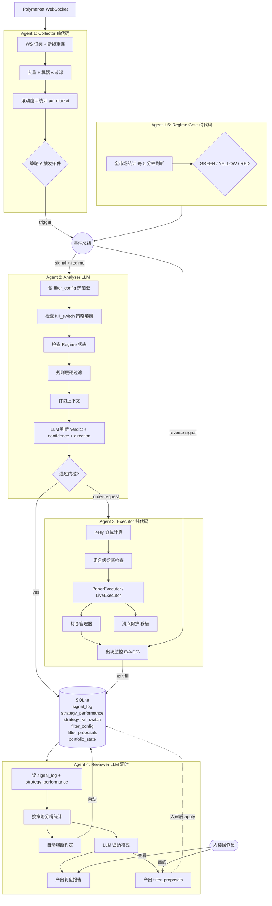

# Polymarket 多 Agent 交易系统 v2 — 设计文档

**日期**：2026-04-06
**状态**：草案 v2（基于旧系统诊断后重写），待审阅
**核心目标**：**稳定持续盈利**（capital preservation 优先于收益最大化）
**新仓库位置**：`D:/work/polymarket-agent-v2/`
**参考项目（旧系统）**：[west-garden/polymarket-agent](https://github.com/west-garden/polymarket-agent)

---

## 1. 背景与核心目标

本项目是对现有 `west-garden/polymarket-agent` 的**全面重写**，不是从零开发。旧系统架构有可取之处，但存在若干系统性的亏损根因（见 §2），导致"盈利不稳"。新系统的唯一目标是：

> **在 Polymarket 上实现稳定的持续盈利 — 优先保全资本，其次才是收益最大化。**

### 1.1 什么叫"稳定"

本项目对"稳定"的定义是可量化的：

- **月度回撤 ≤ 5%**（月内最大相对峰值回撤）
- **单日亏损 ≤ 2%** 即触发当日熔断，停止新开仓
- **连续亏损策略 ≥ 10 笔胜率 < 45%** → 自动暂停该策略直到人审
- **月度 Sharpe ≥ 1.0**（不追求极高收益，追求收益/波动比）
- 不追求"爆发周大赚"，宁可月收益 2%-4% 稳定，也不要"赚 15% 再回吐 20%"

### 1.2 非目标（明确不做）

- ❌ 高频套利（时间尺度是分钟到小时）
- ❌ 杠杆 / 衍生品
- ❌ 多策略"分散化"的幻觉（已验证会互相抵消，详见 §2）
- ❌ 外部新闻/Twitter 集成（首版不做，Polymarket 自身数据足够）
- ❌ 未经验证的阈值"调优"（所有阈值要么来自真实数据，要么标记为"初始猜测，等 Reviewer 校准"）
- ❌ 完全自动的规则迭代（所有参数变动必须经人审）

---

## 2. 旧系统诊断结论（重写的出发点）

对旧系统做了完整代码审阅，验证了 6 条诊断假设：

| 代号 | 假设 | 结论 | 证据位置 |
|------|------|------|---------|
| **H1** | 策略互相抵消 + race condition | ✅ **坐实（比预想更糟）** | 见 §2.1 下方详述 |
| **H2** | 共识验证被豁免机制架空 | ✅ **坐实（比预想更糟）** | 见 §2.2 下方详述 |
| **H3** | $30/market 仓位吃不掉成本 | ✅ **坐实** | 10% 盈利 = $3，扣 0.5% fee + 2-3% 滑点 + gas $0.15，55% 胜率仍亏钱 |
| **H4** | 过拟合规则集 | ⚠️ **部分坐实** | 14 个硬编码阈值，`[0.60, 0.85]` dead zone 声称"历史数据"但仓库里**没有任何数据文件**，所有 EV 声明都是空口 |
| **H5** | 反馈回路是 dead code | ✅ **坐实（比预想更糟）** | 见 §2.3 下方详述 |
| **H6** | data_only + 共识 = 慢决策 | ⚠️ **部分** | 机制存在但无延迟埋点，不可量化 |

### 2.1 H1 详述：两种策略冲突机制（race + churn）

两个独立的问题叠在一起：

**(a) Race condition（`automaton_v2.py:913` vs `:1329/:1491`）**

`market_to_strategy` dict 的读（line 913）和写（line 1329、1491）之间**完全没有锁**。两个策略在同一 market 同时收到信号时，都读到 `held_by=None`，都通过冲突检查，都开仓 —— 结果是同一 market 两条反向持仓，capital 被冻结，成本双倍。

**(b) UCB 挑战 churning（`automaton_v2.py:929-936`）** ⚠️ **子 agent 未发现**

当冲突被正确检测到时，代码会**主动平掉已有仓位、让新信号进场**：

```python
if challenger_ucb > holder_ucb * self.param_config.strategy_challenge_threshold:
    logger.info(f"  ✅ 挑战成功，平掉原持仓")
    await self._close_position(
        condition_id=signal.condition_id, reason="策略挑战成功"
    )
```

UCB 分数会随每笔结果小幅波动。意味着：
1. 策略 A 在 market X 上有仓位，原计划还没走完
2. 策略 B 来了新信号，B 的 UCB 刚好比 A 高一点点
3. 系统主动平 A（吃滑点 + fee + 未实现盈亏），让 B 开仓
4. 两小时后 A 的 UCB 又高回来，又 churn 一次

**这是旧系统烧钱的另一条隐藏通道**，spec v1 漏了。新系统必须**明确禁止任何基于瞬时分数对比的主动挪仓**（见 §4.4）。

### 2.2 H2 详述：不是 1 个豁免，是 4 个 OR 在一起

子 agent 只报告了尾盘 ≥0.90 豁免。实际 `automaton_v2.py:489-512`：

```python
is_tail_market       = signal.yes_price >= 0.90
is_copytrading_consensus = ("copytrading" in strategy) and trader_count >= 3
is_flow_consensus    = (signal_type == "consensus_flow") and trader_count >= 3
is_high_confidence   = signal.confidence >= 0.70

skip_consensus = is_tail_market or is_copytrading_consensus
              or is_flow_consensus or is_high_confidence
```

**四个豁免 OR 在一起，任意一个命中就跳过共识验证。** 最致命的是第四个 —— `signal.confidence` 是**策略自填的**（self-reported），每个策略发出的信号基本都 ≥ 0.70（否则它自己都不会发）。结论：

> **共识验证机制在实际运行中几乎从不生效。它存在只是让代码看起来有防护。**

新系统必须删除**全部 4 个豁免**，并且不接受任何策略的 self-reported confidence 作为决策依据。

### 2.3 H5 详述：反馈回路是 dead code，不是"没写"

旧系统的情况比"没写反馈回路"更荒谬：反馈回路的接口层**存在**，但从没被接进主循环。

- `StrategyCalibrator` 在 `automaton_v2.py:391` 正常初始化
- 它的桥接方法定义在两处：
  - `update_dynamic_dead_zones()` — `automaton_v2.py:1894`
  - `get_calibration_report()` — `automaton_v2.py:1922`
- 这两个方法**分别**会调 `calibrator.calculate_dead_zones()` 和 `calibrator.get_strategy_recommendations()`
- **但 grep 全仓库**：这两个方法**只有定义，没有任何调用**

```
automaton_v2.py:1894:    def update_dynamic_dead_zones(...):
automaton_v2.py:1922:    def get_calibration_report(...):
```

开发者写了一半就放弃了，留下一套看起来像"有反馈学习"的 dead code。**旧系统不仅没有学习能力，它还在代码里假装有学习能力。** 这对新系统的意义：Reviewer Agent 必须从一开始就设计成"**被主循环定时调用**"，而不是"提供被动 API 等外面来读"，否则会重蹈覆辙。

### 2.1 诊断中额外发现的问题

- 多处 `bare except` 吞异常（关键 API 失败仅在 DEBUG 级别记日志，系统带病运行）
- 仓位 / PnL 计算**完全没算 gas fee**（每笔 ~$0.15，在 $30 仓位上是 -25% 利润）
- `FlowSniper` 模块定义了但从没 wire 进主循环（dead code）
- 多处关键 `None` 检查缺失（`best_bid/ask` 回退路径不 validate）

### 2.2 诊断中发现的"可移植优点"

这些是旧系统设计正确的部分，新系统**直接移植**，不重写：

- `consensus_checker.py` —— 多策略共识验证框架，思路正确，只是被豁免削弱
- `slippage_protection.py` —— 滑点检测 + 拆单建议，逻辑正确，只是阈值没校准
- `PositionTracker`（`copy_strategy.py` 里的）—— 细粒度买卖成本基记账
- `regime_detector.py` —— 区分 retail-dominant vs bot-dominant market 的思路
- `smart_money_service_v2.py` 的 `_condition_buffers` —— 数据底座

### 2.3 旧系统的三大致命伤（按 PnL 影响排序）

1. **没反馈回路（H5）** — 亏损策略永远不会被关掉
2. **尾盘 ≥0.90 豁免（H2）** — 系统性交易 1:9 负期望
3. **跨策略持仓冲突（H1 race condition）** — 每次冲突锁住 $60 capital 净赔 $6

---

## 3. 新系统设计哲学

### 3.1 三条核心原则

**原则 1：少即是多**
旧系统 5 个策略互相打架。新系统**只保留 2 个核心策略**：一个产生 alpha，一个决定何时不该交易。复杂度是稳定性的敌人。

**原则 2：反馈回路是系统灵魂**
Reviewer Agent 不是"可选增强"，是**核心模块**。任何一笔交易做出的决策都必须能在 1 周内被数据反馈校准。没有反馈回路的交易系统是开环系统，开环系统在市场里无法稳定。

**原则 3：快反应用代码，慢思考用 LLM**
- 数据订阅、滚动统计、止盈止损触发 → 纯 Python，毫秒级，确定性
- 信号真伪判断、复盘归因、策略熔断决策 → LLM（少量调用、高价值）

### 3.2 四道防线（Defense in Depth）

稳定性靠多层独立防线，不靠单个"聪明"模块：

```
┌────────────────────────────────────────────────────────────┐
│ 防线 1：入场过滤（硬阈值 + LLM 判断）                       │
│   不满足基本条件的信号进不来                                │
└────────────────────────────────────────────────────────────┘
                         │
                         ▼
┌────────────────────────────────────────────────────────────┐
│ 防线 2：仓位管理（Kelly + 硬上限）                          │
│   即使信号错了，单笔损失也可控                              │
└────────────────────────────────────────────────────────────┘
                         │
                         ▼
┌────────────────────────────────────────────────────────────┐
│ 防线 3：实时止损（A/C/D/E 四路并行）                        │
│   仓位进去之后，出场机制独立多层                            │
└────────────────────────────────────────────────────────────┘
                         │
                         ▼
┌────────────────────────────────────────────────────────────┐
│ 防线 4：组合级熔断（日内 DD / 策略熔断 / 相关性限制）        │
│   即使前三道都失效，组合层面止血                            │
└────────────────────────────────────────────────────────────┘
```

---

## 4. 策略设计

### 4.1 唯一的 edge 假设

> **"在赔率 0.20–0.85 的中等区间，当 Polymarket 上出现 `价格变动 + 成交量确认 + 多人真钱共识` 三路信号同时发生时，存在真实的短期定价偏差，LLM 能够在这个偏差上做出正确的方向判断。"**

这个假设比旧系统谦虚得多 —— 它**明确排除**了：
- ≥ 0.85 的高置信区（赔付比不对称，一次失误回吐数周利润）
- ≤ 0.20 的低置信区（underdog 反弹是噪音驱动，旧系统 Trailing Stop 已证明不赚钱）
- 极端短期（< 30 分钟到期）市场（不给判断留反应时间）

### 4.2 两个核心策略

只保留两个策略，且**职责不重叠**：

#### 策略 A：Smart Money Flow（唯一的 alpha 源）

**数据输入**：Polymarket WebSocket activity stream
**触发条件**（全部必须满足）：

| 条件 | 阈值（初始值，待 Reviewer 校准） |
|------|---------------------------------|
| 单笔金额过滤 | ≥ $200（过滤散户噪音） |
| 净流入（买方向 - 卖方向，1 分钟窗口） | ≥ $3000 |
| 独立 trader 数（1 分钟窗口） | ≥ 3 人 |
| 赔率移动（5 分钟窗口） | ≥ 3% 且方向一致 |
| market 赔率区间 | 0.20 ≤ price ≤ 0.85 |
| 流动性（order book 深度） | ≥ $5000 |
| 剩余时间 | 30 分钟 ≤ time_to_resolve ≤ 72 小时 |
| 非 "up or down" 类短期赌博 market | 黑名单过滤 |

**机器人过滤**：任何地址在 1 秒内 > 10 笔交易 → 该地址当 session 内全部成交忽略

**大单豁免**（跳过 trader 数量要求，但**不豁免共识和其他条件**）：
- 单笔 ≥ $5000，或
- 净流入 ≥ $10000

#### 策略 B：Regime Gate（不是 alpha 源，而是"熔断闸门"）

**唯一职责**：判断"当前 Polymarket 整体 regime 是否适合策略 A 开仓"。

**输入**：过去 1 小时全市场成交量分布、bot-dominated market 比例、平均 spread
**输出**：`GREEN`（正常）/ `YELLOW`（谨慎，仓位减半）/ `RED`（禁止新开仓）

**Regime 判定规则**（初始版本，后续由 Reviewer 校准）：
- `RED`：全市场 bot-dominated ratio > 70% 或 平均 spread > 5%（市场做市商罢工）
- `YELLOW`：介于中间
- `GREEN`：默认

**为什么把 Regime 单独拎出来**：旧系统把 regime 检测当作可选 env var (`ENABLE_REGIME_DETECTION`)。新系统把它**升级成策略 A 的前置门禁**：只要 Regime 不是 GREEN，策略 A 的信号至少仓位减半；RED 时完全停手。

### 4.3 明确砍掉的旧策略

- ❌ Tail Strategy（≥0.70 追高，和 Smart Money Flow 的 ≤0.85 上限冲突）
- ❌ Trailing Stop（<0.50 反弹，已证明不赚钱）
- ❌ Outlier Sniper（和 Smart Money Flow 的信号逻辑 90% 重叠）
- ❌ Copytrading V2 的独立存在（其共识逻辑合并进 Smart Money Flow 的"多人共识"检查）

### 4.4 明确砍掉的旧机制（基于 §2 诊断）

- ❌ **全部 4 个共识豁免**（is_tail_market / is_copytrading_consensus / is_flow_consensus / is_high_confidence）—— 新系统硬规则就是硬规则，不接受 self-reported confidence 作为决策依据
- ❌ **UCB 挑战 churning**（`automaton_v2.py:929-936`）—— 新系统**禁止任何形式的主动持仓调整**。冲突处理一律使用 **first-come-first-served + reject later signal**：市场已被任何策略持有就直接拒绝后到的信号，不比较、不挪仓、不挑战
- ❌ **Bandit 优化器**（`BanditOptimizer`）—— 旧系统的 Bandit 只跑内存状态、不读历史数据，且是"挪仓 churning" 的间接根源。新系统不做策略间的动态权重调整，策略权重的变动**只**通过 Reviewer Agent 的人审 filter_proposals
- ❌ **Self-reported confidence**作为任何决策的输入 —— LLM 判断的 confidence 只用于 signal_log 记录和 Reviewer 复盘，**不作为是否下单的门槛**。下单门槛只看硬规则是否全部满足

---

## 5. 出场规则（防线 3）

| 代号 | 机制 | 触发条件 | 默认参数 |
|------|------|---------|---------|
| **E** | 执行安全缓冲 | 距 resolution 剩余时间 < buffer（仅为确保平仓单能落地） | 5 分钟（实际值需查 Polymarket CLOB lock 时间，标记 `TBD_FROM_POLYMARKET_DOCS`） |
| **A-SL** | 硬止损 | 当前价穿越入场价 ±止损% | 常规：7%；**late-stage（剩余 < 30 分钟）收紧到 3%** |
| **D** | 反向信号止损 | Collector 在同一 market 触发了**反方向**的策略 A 信号 | 立即平仓 |
| **A-TP** | 硬止盈 | 当前价达到预设止盈线 | 10% |
| **C** | 时间止损 | 持仓时长 > 上限 | 4 小时 |

**触发优先级**（从高到低）：**E > A-SL > D > A-TP > C**

**关键差异于旧系统**：
- ❌ **没有尾盘豁免**。≥ 0.85 的 market 策略 A 根本不会进场（§4.1），所以没有"尾盘平仓"这个概念
- ✅ **late-stage 止损收紧**：哪怕是 ≤ 0.85 的持仓，一旦剩余时间 < 30 分钟就收紧止损到 3%（尾盘赔率跳变风险）
- ✅ **D（反向信号）是主要预期出场**："进场理由消失就出场"

---

## 6. 仓位与资金管理（防线 2 和 4）

### 6.1 单笔仓位 — Kelly 动态计算

旧系统固定 $30/market，吃不掉成本。新系统用**分数 Kelly**动态算单笔大小：

```
fraction = (win_rate × payoff_ratio - (1 - win_rate)) / payoff_ratio
position_size = total_capital × fraction × kelly_multiplier
```

**关键约束**：

- `kelly_multiplier = 0.25`（四分之一 Kelly，牺牲收益换稳定）
- `win_rate` 来自**该策略过去 30 天的实际胜率**（Reviewer 维护，没有足够样本则用默认 0.50）
- `position_size` 硬上下限：**$100 ≤ size ≤ $300**
  - $100 下限：确保 fee + 滑点占比 < 3%
  - $300 上限：确保单笔最大损失 < 总资金 2%

### 6.2 组合级别限制

- **总持仓上限**：$2000（旧系统 $700，新系统提高 —— 因为单笔更大、仓位更少）
- **同时持仓数量**：≤ 8 个
- **相关性限制**：同一"事件簇"（比如同一场选举的不同 market）最多 2 个持仓
- **gas fee 计入**：每笔交易预留 $0.20 gas 到 PnL 计算，不作为"免费成本"

### 6.3 组合级熔断（防线 4）

| 熔断类型 | 触发条件 | 动作 |
|---------|---------|------|
| **日内回撤熔断** | 当日 PnL ≤ -2% × total_capital | 停止新开仓，已有持仓按原规则出场，次日 UTC 0 点重置 |
| **周回撤熔断** | 周内 PnL ≤ -4% | 停止新开仓，持仓减半（一半出场），人审后才能恢复 |
| **策略熔断** | 单策略连续 10 笔胜率 < 45% | 自动写 `strategy_kill_switch` 表，Analyzer 停止接受该策略信号，Reviewer 下次运行时人审 |
| **总回撤熔断** | 历史峰值回撤 > 10% | 紧急停机模式：全部持仓 30 分钟内平完，系统停机等待人工介入 |

---

## 7. 模块架构



### 7.1 各 Agent 职责

**Agent 1 — Collector（纯代码，常驻）**
- 订阅 WS、断线重连、去重、机器人地址过滤
- 按 market 维护滚动窗口状态（1m/10m volume, unique traders, price path）
- 触发策略 A 条件时发 `TriggerEvent`

**Agent 1.5 — Regime Gate（纯代码，定时）**
- 每 5 分钟扫一次全市场统计
- 维护当前 regime 状态（GREEN/YELLOW/RED）
- 状态变化时发 `RegimeChangeEvent`

**Agent 2 — Analyzer（LLM，触发式）**
- 订阅 `TriggerEvent`
- **顺序检查**：kill_switch → regime → 硬过滤 → LLM 判断 → 下单门槛
- 所有 LLM 调用落盘审计
- LLM 调用超时 30 秒即放弃该信号

**Agent 3 — Executor（纯代码，常驻）**
- Kelly 仓位计算
- 组合级熔断检查（拒单）
- **冲突检查用 asyncio.Lock 保护**（修复旧系统 race condition）
- **冲突处理策略：first-come-first-served，后到信号直接 reject**（修复旧系统 UCB churning）
- PaperExecutor（v1） / LiveExecutor（v2 预留）
- 持仓管理器 + E/A/D/C 四路出场监控
- 移植旧系统的 `PositionTracker` 和 `slippage_protection`
- **禁止主动平仓换仓**：现有持仓只能由 E/A/D/C 四路规则触发平仓，不能被任何"新信号更好"的逻辑主动替换

**Agent 4 — Reviewer（LLM，定时 + 手动）**
- **必须由主循环定时调用**（默认每日 00:00 UTC），不能只提供被动 API 等外面来读 —— 这是旧系统 H5 的根本教训：旧系统 `update_dynamic_dead_zones()` 和 `get_calibration_report()` 定义了但**从没被调用**，反馈回路成了 dead code
- 默认每天运行一次（不是每周 —— 早期数据少，需要快速反馈）
- 读 `signal_log` + `strategy_performance`
- 自动判定并写 `strategy_kill_switch`（无需人审 —— 熔断是安全机制）
- LLM 归纳模式 → 产出 `filter_proposals`（需要人审）
- 产出人类可读的复盘报告

---

## 8. 数据模型

### 8.1 `signal_log`（中枢表）

| 字段 | 类型 | 说明 |
|------|------|------|
| `signal_id` | TEXT PK | UUID |
| `market_id` | TEXT | |
| `market_title` | TEXT | |
| `market_event_cluster` | TEXT | 用于相关性限制（§6.2） |
| `resolves_at` | TIMESTAMP | |
| `triggered_at` | TIMESTAMP | |
| `strategy` | TEXT | `smart_money_flow` 或将来的其他 |
| `regime_at_trigger` | TEXT | `GREEN/YELLOW/RED` |
| `direction` | TEXT | `buy_yes` / `buy_no` |
| `entry_price` | REAL | |
| `size_usdc` | REAL | Kelly 算出的实际仓位 |
| `kelly_fraction` | REAL | 记录 Kelly 计算用的 fraction |
| `snapshot_volume_1m` | REAL | |
| `snapshot_net_flow_1m` | REAL | |
| `snapshot_unique_traders_1m` | INTEGER | |
| `snapshot_price_move_5m` | REAL | |
| `snapshot_liquidity` | REAL | |
| `llm_verdict` | TEXT | |
| `llm_confidence` | REAL | |
| `llm_reasoning` | TEXT | |
| `exit_at` | TIMESTAMP NULL | |
| `exit_price` | REAL NULL | |
| `exit_reason` | TEXT NULL | `E/A_SL/A_TP/D/C` |
| `pnl_gross_usdc` | REAL NULL | 毛盈亏 |
| `fees_usdc` | REAL NULL | Polymarket fee |
| `slippage_usdc` | REAL NULL | 实际滑点 |
| `gas_usdc` | REAL NULL | 预估 gas |
| `pnl_net_usdc` | REAL NULL | 净盈亏（= gross - fees - slippage - gas） |
| `holding_duration_sec` | INTEGER NULL | |
| `mode` | TEXT | `paper` / `live` |

**关键差异于旧系统**：`pnl_net_usdc` 字段**强制**包含 fees + slippage + gas。这是旧系统 H3 的根本修复。

### 8.2 `strategy_performance`（Reviewer 维护的滚动统计）

| 字段 | 类型 |
|------|------|
| `strategy` | TEXT PK |
| `window` | TEXT PK（`1d` / `7d` / `30d`） |
| `trade_count` | INTEGER |
| `win_count` | INTEGER |
| `win_rate` | REAL |
| `total_pnl_net` | REAL |
| `avg_pnl_per_trade` | REAL |
| `profit_factor` | REAL（毛盈利 / 毛亏损） |
| `sharpe` | REAL |
| `max_drawdown` | REAL |
| `last_updated` | TIMESTAMP |

### 8.3 `strategy_kill_switch`

| 字段 | 类型 |
|------|------|
| `strategy` | TEXT PK |
| `killed_at` | TIMESTAMP |
| `reason` | TEXT |
| `trigger_win_rate` | REAL |
| `trigger_sample_size` | INTEGER |
| `status` | TEXT (`killed` / `reviewed_keep_killed` / `reviewed_reenabled`) |
| `reviewed_at` | TIMESTAMP NULL |

### 8.4 `filter_config`

KV 表 + 热加载（同 v1 设计）。

### 8.5 `filter_proposals`

Reviewer 产出的待审建议（同 v1 设计）。

### 8.6 `portfolio_state`

| 字段 | 类型 |
|------|------|
| `key` | TEXT PK |
| `value` | REAL / TEXT |
| `updated_at` | TIMESTAMP |

关键 key：`total_capital`, `current_equity`, `day_start_equity`, `week_start_equity`, `peak_equity`, `current_drawdown`, `daily_halt_triggered`, `weekly_halt_triggered`

### 8.7 `llm_audit_log`

每次 LLM 调用的完整记录（prompt、response、tokens、latency）。

---

## 9. 技术栈

| 组件 | 选择 |
|------|------|
| 语言 | **Python 3.11+**（已确认） |
| LLM | **Claude Opus 4.6** (`claude-opus-4-6`) |
| LLM SDK | `anthropic` 官方 Python SDK |
| Polymarket SDK | `py-clob-client`（旧系统已经用这个） |
| 数据库 | **SQLite**（单文件，未来可迁 Postgres） |
| WS 客户端 | `websockets` |
| 事件总线 | `asyncio.Queue` 自定义轻量 pub/sub |
| 配置 | YAML + `filter_config` 表热加载 |
| CLI | `typer` |
| 测试 | `pytest` + `pytest-asyncio` |
| 数据分析（Reviewer 用） | `pandas` + `numpy` |

---

## 10. 错误处理与可靠性

### 10.1 强制规则

- **禁止 bare `except:`** —— 旧系统吃异常的恶习必须根除，所有 except 必须指定具体异常类
- **API 失败必须 ERROR 级别日志** —— 不能像旧系统那样 DEBUG 级别吞掉
- **所有 nullable 返回必须显式检查**
- **gas fee 必须进 PnL 计算** —— 不能当免费成本

### 10.2 典型故障恢复

- **WS 断线**：指数退避重连；断线期间持仓继续按 A/C/E 监控（Executor 独立于 Collector）
- **LLM 超时 / rate limit**：Analyzer 单次超时 30 秒放弃，不重试
- **数据库写失败**：critical error，进入 safe mode（停新单，已有持仓继续保护）
- **崩溃恢复**：启动时扫 `signal_log.exit_at IS NULL` 重建内存持仓状态；同时读 `portfolio_state` 恢复熔断标志
- **Polymarket API down**：Executor 进 safe mode，Reviewer 仍可运行（只读）

---

## 11. 测试策略

### 11.1 单元测试

- Collector 滚动窗口计算（用录制的 WS 数据回放）
- 触发器条件组合（所有 true/false 矩阵）
- Regime Gate 状态机
- Kelly 仓位计算（边界值：win_rate=0, win_rate=1, 无历史样本）
- 四路出场逻辑 + 优先级
- 组合级熔断触发
- `strategy_kill_switch` 写入和读取

### 11.2 集成测试

- 录制 1 小时真实 WS 数据 → 端到端 paper trading → 断言 signal_log + PnL 一致
- 注入亏损序列 → 验证 kill_switch 触发
- 注入 2% 日内回撤 → 验证 daily halt 触发

### 11.3 覆盖率要求

- Executor 模块（防线 2 和 3）：**100% 分支覆盖**
- 熔断模块：**100% 分支覆盖**
- 其他：**≥ 80%**

---

## 12. 分阶段交付里程碑

**注：旧系统没在跑，所以没有历史数据可用。baseline 必须从新系统的 paper trading 第一周起采集。这是本项目的约束，不是选择。**

### M1 — Bootstrap + 数据底座（Week 1–2）

- 新建 repo `D:/work/polymarket-agent-v2/`
- pyproject.toml / pytest / Claude SDK / Polymarket SDK
- Collector：WS 订阅 + 滚动窗口 + 机器人过滤
- SQLite schema + migrations（所有表）
- CLI：`start collector`、`status`
- **交付标准**：能持续运行 24 小时不崩，`signal_log` 开始有触发记录（不下单，只记日志）

### M2 — Analyzer + Regime Gate + PaperExecutor（Week 3–4）

- 移植旧系统的 `slippage_protection` + `PositionTracker`
- Regime Gate（GREEN/YELLOW/RED 判定）
- Analyzer + LLM 调用 + 硬过滤 + kill_switch 检查
- PaperExecutor：Kelly 仓位计算、fees+slippage+gas 全计入 PnL
- 四路出场监控（E/A/D/C）
- 组合级熔断（日 / 周 / 总 / 策略）
- **交付标准**：paper trading 完整跑 1 周、signal_log 有完整进出记录、所有熔断机制能被集成测试触发

### M3 — Reviewer Agent + 反馈回路（Week 5）

- Reviewer：读 signal_log → 按策略分桶统计 → 写 strategy_performance
- 自动 kill_switch 判定
- LLM 归纳 → filter_proposals
- CLI：`review run`、`proposal list/approve/reject`
- filter_config 热加载
- **交付标准**：Reviewer 手动 + 每日定时运行都能产出报告；有 bad trade 序列时 kill_switch 能自动触发

### M4 — 生产化与监控（Week 6）

- 监控看板（最简：每日 PnL、持仓、熔断状态的 HTML 报告）
- 告警（熔断触发 → 本地弹窗 / 邮件）
- LiveExecutor 接口实现（真钱但先用最小测试资金）
- 真盘前的完整检查清单
- **交付标准**：具备切真盘的条件，但不自动切

### M5 — 小额真盘验证（Week 7+）

- 先用 $500–$1000 小额资金切真盘
- 观察 2–4 周
- 对比 paper vs live 的 PnL 差异（验证滑点建模是否准确）
- **才能** 扩大到目标资金量

---

## 13. 已确认的设计决定

- **目标**：稳定持续盈利（月度 DD ≤ 5%、Sharpe ≥ 1.0）
- **语言**：Python 3.11+
- **旧系统处理**：重写，不迁移；保留 5 个可移植模块
- **策略数**：只 2 个（Smart Money Flow + Regime Gate）
- **尾盘处理**：禁区 ≥ 0.85，不进场；late-stage 止损收紧到 3%
- **仓位**：1/4 Kelly + $100 下限 + $300 上限 + $2000 总上限
- **反馈回路**：Reviewer 每日运行，自动 kill_switch，人审 filter_proposals
- **仓库位置**：`D:/work/polymarket-agent-v2/`
- **baseline 数据**：从新系统第一周 paper trading 起采集（旧系统无数据可用）

---

## 14. 开放问题（待实现前决定）

1. **监控 market 范围**：Polymarket 当前 24h 成交额前 50，还是全量？
2. **Paper 起始资金**：默认 $10,000 USDC，真盘起步 $500–$1000？
3. **Polymarket CLOB 实际 lock 时间**：E（执行安全缓冲）的真实值 —— 实现第一步要查官方文档并验证
4. **告警通道**：本地弹窗、邮件、Telegram、Feishu？
5. **Reviewer 手动触发频率预期**：除了每日定时，用户还会怎么用它？

---

## 15. 参考

- [west-garden/polymarket-agent](https://github.com/west-garden/polymarket-agent) — 旧系统代码库（重写出发点）
- [Polymarket/agent-skills](https://github.com/Polymarket/agent-skills) — 官方 skill 参考
- Polymarket CLOB API & WebSocket docs
- Kelly criterion（分数 Kelly 的风控应用）
